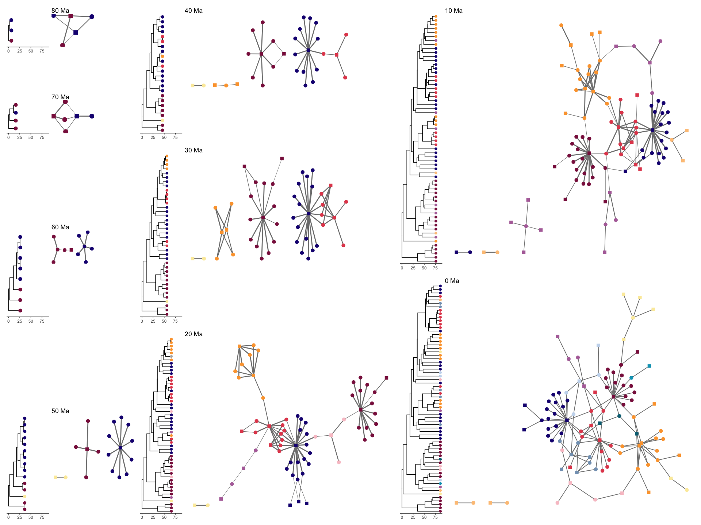

Pieridae host repertoire - Character history
================
Mariana Braga
09 July, 2021

------------------------------------------------------------------------

Script 2 for analyses performed in Braga et al. 2021 *Phylogenetic
reconstruction of ancestral ecological networks through time for pierid
butterflies and their host plants*, Ecology Letters.

## Set up

For this script we’ll need a package to analyze the output posterior
distribution for character history. You can install it from GitHub:

``` r
# install.packages("devtools")
devtools::install_github("maribraga/evolnets")
```

We also need other packages

``` r
library(evolnets)
library(ape)
library(dispRity)
library(ggtree)
library(tidyverse)
library(patchwork)
library(ggraph)
library(tidygraph)
library(igraph)
library(bipartite)
```

## Data

First we read in the phylogenetic trees for butterflies and plants.
Then, we read in the interaction matrix and remove plants (rows) that
are not hosts to any butterfly.

**Trees**

``` r
tree <- read.tree("./data/tree_nodelab.tre")
host_tree <- read.tree("./data/angio_pie_50tips_ladder.phy")
```

**Extant network**

``` r
ext_net_50h <- as.matrix(read.csv("./data/incidence_pieridae.csv", header = T, row.names = 1))
identical(colnames(ext_net_50h), host_tree$tip.label)
identical(rownames(ext_net_50h), tree$tip.label)
```

``` r
ext_net <- ext_net_50h[,which(colSums(ext_net_50h) != 0)]
dim(ext_net)
```

    ## [1] 66 33

## Character history

**Read in .history.txt files**

These files can get quite big, so I compressed them to upload on Github.
You’ll have to unzip them first in your computer to use them. Also, you
might want to thin out these files to speed up their parsing. In the
original files, there is one sample every 50 generations. If you
increase this interval, you reduce the number of samples.

We’ll use *evolnets* function `read_history()` to read one file with
sampled histories when using the time-calibrated host tree, and one
using the transformed host tree (all branch lengths = 1).

``` r
history_time <- read_history('./inference/out.2.real.pieridae.2s.history.txt')
history_bl1 <- read_history('./inference/out.3.bl1.pieridae.2s.history.txt')

# remove burn-in
history_time <- dplyr::filter(history_time, iteration > 20000)
history_bl1 <- dplyr::filter(history_bl1, iteration > 20000)
```

From now on, we’ll only use the history inferred measuring the distance
between hosts in terms of cladogenetic events (`history_bl1`). You can
repeat all steps with `history_time` to get the results when distances
between hosts are measured in terms of anagenetic change.

### Effective rate of evolution

Let’s calculate the average number of events (host gains and host
losses) across MCMC samples. Of those, how many are gains and how many
are losses?

``` r
(n_events <- count_events(history_bl1))
```

    ## [1] 148.5197

``` r
(gl_events <- count_gl(history_bl1))
```

    ##    gains   losses 
    ## 75.33333 73.18639

Similarly, we can calculate the rate of host-repertoire evolution across
the branches of the butterfly tree, which is the number of events
divided by the sum of branch lengths of the butterfly tree. In this
case, we inferred that the rate of evolution is around 6 events every
100 million years, along each branch of the Pieridae tree.

``` r
(rate <- effective_rate(history_bl1,tree))
```

    ## [1] 0.06171999

### States at internal nodes

A traditional approach for ancestral state reconstructions is to get the
posterior probability for each state at internal nodes of the tree. In
our case, we calculated the probability of interactions between each
internal node in the butterfly tree and each host taxon.

First, we need to choose which internal nodes we want to include. For
that, we need to look at the labels at the internal nodes of the tree
file exported by RevBayes.

``` r
plot(tree, show.node.label = TRUE, cex = 0.5)
```

<!-- -->

Then we calculate the probabilities and, using *igraph*, we transform
the matrix into an edge list for plotting. This step is a bit slow, so
you can skip it and load the edge list below.

``` r
# which internal nodes to use? I'll go for all of them.
nodes <- 67:131
pp_at_nodes <- evolnets::posterior_at_nodes(history_bl1, nodes, host_tree)[[2]]

graph <- igraph::graph_from_incidence_matrix(pp_at_nodes, weighted = TRUE)

edge_list_nodes <- igraph::get.data.frame(graph, what = "edges") %>% 
  dplyr::mutate(from = factor(from, levels = paste0("Index_",nodes)),
                to = factor(to, levels = host_tree$tip.label)) %>% 
  rename(p = weight)
```

Now we can plot the probabilities of interactions at internal nodes.
Figure 2 was drawn based on these plots and the phylogenetic trees.

``` r
# all interactions
gg_all_nodes <- ggplot(edge_list_nodes, aes(x = to, y = from)) +
  geom_tile(aes(fill = p)) +
  scale_x_discrete(drop = FALSE) +
  scale_y_discrete(drop = FALSE) +
  scale_fill_gradient(low = "white", high = "black") +
  labs(fill = "Posterior\nprobability") +
  theme_bw() +
  theme(
    axis.text.x = element_text(angle = 270, hjust = 0, size = 7),
    axis.text.y = element_text(size = 7),
    axis.title.x = element_blank(),
    axis.title.y = element_blank())

# only high probability
gg_high_nodes <- filter(edge_list_nodes, p >= 0.9) %>%
  ggplot(aes(x = to, y = from)) + 
  geom_tile(aes(fill = p)) +
  scale_x_discrete(drop = FALSE) +
  scale_y_discrete(drop = FALSE) +
  scale_fill_gradient(low = "grey50", high = "black") +
  labs(fill = "Posterior\nprobability") +
  theme_bw() +
  theme(
    axis.text.x = element_text(angle = 270, hjust = 0, size = 7),
    axis.text.y = element_text(size = 7),
    axis.title.x = element_blank(),
    axis.title.y = element_blank())
```

``` r
gg_all_nodes + gg_high_nodes
```

<!-- -->

### Ancestral networks

**(at given ages)**

We can do this in two ways:

1.  Summarize the posterior probabilities of interactions into one
    network per time point
2.  Represent each time point by all networks sampled during MCMC

#### Summary networks

`posterior_at_ages( )` finds the parasite lineages that were extant at
given time points (ages) in the past and calculates the posterior
probability for interactions between these parasites and each host.

``` r
# first choose the ages
ages <- seq(80,10,-10)
```

``` r
# slow!
at_ages <- posterior_at_ages(history_bl1, ages, tree, host_tree)
pp_at_ages <- at_ages[[2]]
```

``` r
# quick solution 
pp_at_ages <- readRDS("./inference/pp_at_ages.rds")
```

We can add the extant network to the list with all ancestral networks,
so that later they processed at the same time. Also add time 0 to `ages`

``` r
pp_at_ages[[9]] <- ext_net
ages <- c(ages,0)
```

Then, we can make different incidence matrices based on two things: the
minimum interaction probability and whether to make a weighted or binary
network. To build weighted networks we use the posterior probabilities
as weights for each interaction. But since many interactions have really
small probabilities, we can set a minimum probability, below which the
weight is set to 0. In binary networks, only links with probability
higher than the threshold are assumed to be present and all others are
assumed absent.

``` r
weighted_net_10 <- get_summary_network(pp_at_ages, pt = 0.1, weighted = TRUE)
weighted_net_50 <- get_summary_network(pp_at_ages, pt = 0.5, weighted = TRUE)
binary_net_90 <- get_summary_network(pp_at_ages, pt = 0.9, weighted = FALSE)
```

Now we can identify the modules in each of the three summary networks at
each age and plot them. Here, I’ll go through all the steps with the
`weighted_net_50` network. You can repeat the same steps for the other
networks.

#### Find modules

(stochastic step!)

``` r
all_wmod50 <- tibble()

for(i in 1:length(weighted_net_50)){
  set.seed(5)
  wmod <- computeModules(weighted_net_50[[i]])
  assign(paste0("wmod50_",ages[i]),wmod)
  wmod_list <- listModuleInformation(wmod)[[2]]
  nwmod <- length(wmod_list)
  
  for(m in 1:nwmod){
    members <- unlist(wmod_list[[m]])
    mtbl <- tibble(name = members, 
                   age = rep(ages[i], length(members)),
                   original_module = rep(m, length(members)))
                   
    all_wmod50 <- bind_rows(all_wmod50, mtbl)
  }
}
```

``` r
# you can check the modules for some network like so
bipartite::plotModuleWeb(wmod50_50, labsize = 0.4)
```

<!-- -->

**Match modules across ages**

I modified `all_wmod50` outside R to match the modules across ages. Then
I read it in as `all_mod50_edited`.

``` r
all_wmod50_edited <- read.csv("./networks/all_wmod50_bl1.csv", header = T, stringsAsFactors = F)
```

**Make tidygraphs with module information**

Get weighted graph from `weighted_net_50`

``` r
list_wtgraphs50 <- list()
for(n in 1:length(weighted_net_50)){
  wnet <- as.matrix(weighted_net_50[[n]])
  
  wgraph <- as_tbl_graph(t(wnet), directed = F) %>%    
    left_join(filter(all_wmod50_edited, age == ages[n]), by = "name") %>% 
    select(type, name, module)
  
  list_wtgraphs50[[n]] <- wgraph
}
```

**Make tree for each age**

``` r
# Must be a tree with node labels
# and root.time
tree$root.time <- max(tree.age(tree)$ages)

# Slice the tree at ages and create data frame with module info
list_subtreesw50 <- list()
list_tip_dataw50 <- list()

# model "acctran" always uses the value from the ancestral node
for(i in 1:(length(ages)-1)){
  subtree <- slice.tree(tree, age = ages[[i]], "acctran")
  list_subtreesw50[[i]] <- subtree
  
  graph <- list_wtgraphs50[[i]]
  mod_from_graph <- tibble(module = activate(graph,nodes) %>% filter(type == TRUE) %>% pull(module),
                           label = activate(graph,nodes) %>% filter(type == TRUE) %>% pull(name))
  # extra step just to check that tip labels and graph node names match
  tip_data <- tibble(label = subtree$tip.label) %>% 
    inner_join(mod_from_graph, by = "label") 
  list_tip_dataw50[[i]] <- tip_data
}

# add tree and module info for present time
list_subtreesw50[[9]] <- tree
list_tip_dataw50[[9]] <- tibble(label = tree$tip.label) %>% 
  inner_join(filter(all_wmod50_edited, age == 0), by = c("label" = "name"))
```

**Plot ggtree and ggraph (Fig. 3 in the paper)**

``` r
# Choose colors and sizes
wmod_levels50 <- c(paste0('M',1:12))
custom_palw50 <- c("#8a1c4c","#1b1581","#e34c5b","#fca33a","#fbeba9","#fdc486",
                 "#b370a8","#f8c4cc","#c8d9ee","#82a0be","#00a2bf","#006e82")
tip_size = c(3,3,3,2.5,2.5,2,2,2,2)
node_size = c(4,4,3,3,3,3,3,3,3)

for(i in 1:length(ages)){
  
  subtree <- list_subtreesw50[[i]]
  ggt <- ggtree(subtree, ladderize = T) %<+% list_tip_dataw50[[i]] +
    geom_tippoint(aes(color = factor(module, levels = wmod_levels50)), size = tip_size[i]) + 
    geom_rootedge(rootedge = 1) +
    scale_color_manual(values = custom_palw50, na.value = "grey70", drop = F) +
    xlim(c(0,tree$root.time)) +
    theme_tree2() +
    theme(legend.position = "none")
  
  assign(paste0("ggtw50_",ages[[i]]), ggt)
  
  graph <- list_wtgraphs50[[i]]
  
  ggn <- ggraph(graph, layout = 'stress') +
    geom_edge_link(aes(width = weight), color = "grey50") +
    geom_node_point(aes(shape = type, color = factor(module, levels = wmod_levels50)), size = node_size[i]) +
    scale_shape_manual(values = c("square","circle")) +
    scale_color_manual(values = custom_palw50, na.value = "grey70", drop = F) +
    scale_edge_width("Probability", range = c(0.3,1)) +
    labs(title = paste0(ages[[i]]," Ma"), shape = "", color = "Module") + 
    theme_void() +
    theme(legend.position = "none")
  
  assign(paste0("ggnw50_",ages[[i]]), ggn)
}

# define layout
design <- c(patchwork::area(1, 1, 1, 1),
            patchwork::area(1, 2, 1, 2),
            patchwork::area(3, 1, 3, 1),
            patchwork::area(3, 2, 3, 2),
            patchwork::area(6, 1, 7, 1),
            patchwork::area(6, 2, 7, 2),
            patchwork::area(10,1,12, 1),
            patchwork::area(10,2,12, 3),
            patchwork::area(1, 4, 3, 4),
            patchwork::area(1, 5, 3, 6),
            patchwork::area(4, 4, 7, 4),
            patchwork::area(4, 5, 7, 6),
            patchwork::area(8, 4,12, 4),
            patchwork::area(8, 5,12, 6),
            patchwork::area(1, 8, 6, 8),
            patchwork::area(1, 9, 6,11),
            patchwork::area(7, 8,12, 8),
            patchwork::area(7, 9,12,12))
```

``` r
# plot!
ggtw50_80 + ggnw50_80 +
  ggtw50_70 + ggnw50_70 +
  ggtw50_60 + ggnw50_60 +
  ggtw50_50 + ggnw50_50 +
  ggtw50_40 + ggnw50_40 +
  ggtw50_30 + ggnw50_30 +
  ggtw50_20 + ggnw50_20 +
  ggtw50_10 + ggnw50_10 +
  ggtw50_0 + ggnw50_0 +
  plot_layout(design = design)
```

<!-- -->

Note that the tip order here is different from the figure in the paper.
This is because here we are ladderizing the tree with `ggtree` whereas
originally, I was not. Something changed either in `ggtree` or in
`dispRity` and now the tree is not plotted correctly when we set
ladderize = FALSE. Also, the networks have been edited outside R for the
figure in the paper. In any case, the information contained in the
figure is the same.

#### Other plots in Figure 1

Now that we have found the modules for the extant network, we can
produce other plots to combine with the extant butterfly tree and
ancestral states at nodes

``` r
edge_list <- get.data.frame(list_wtgraphs50[[9]], what = "edges") %>%
  inner_join(all_wmod50_edited %>% filter(age == 0) %>% select(name, module), by = c("from" = "name")) %>%
  inner_join(all_wmod50_edited %>% filter(age == 0) %>% select(name, module), by = c("to" = "name")) %>%
  mutate(Module = ifelse(module.x == module.y, module.x, NA))

phylob <- tree$tip.label
phylop <- host_tree$tip.label

plot_net <- edge_list %>% mutate(
  from = factor(from, levels = phylop),
  to = factor(to, levels = phylob))
```

-   **Extant network with modules**

``` r
ggplot(plot_net, aes(x = from, y = to, fill = factor(Module, levels = wmod_levels50))) +
  geom_tile() +
  theme_bw() +
  scale_x_discrete(drop = FALSE) +
  scale_y_discrete(drop = FALSE) +
  scale_fill_manual(values = custom_palw50, na.value = "grey70", drop = T) +
  labs(fill = "Module") +
  theme(
    axis.text.x = element_text(angle = 270, hjust = 0, size = 6),
    axis.text.y = element_text(size = 6),
    axis.title.x = element_blank(),
    axis.title.y = element_blank())
```

<!-- -->

-   **Host tree with modules**

``` r
host_tip_mod <- tibble(label = host_tree$tip.label) %>% 
  inner_join(filter(all_wmod50_edited, age == 0), by = c("label" = "name"))

ggtree_host <- ggtree(host_tree, ladderize = F) %<+% host_tip_mod +
  geom_tippoint(aes(color = factor(module, levels = wmod_levels50)), size = 2, shape = "square") + 
  scale_color_manual(values = custom_palw50,na.value = "grey70", drop = F) +
  labs(color = "Module", title = "Host tree with modules")
```

-   **Butterfly tree with node names**

``` r
ggtree_but <- ggtree(tree) + geom_tiplab(size = 2) + geom_nodelab(size = 2) +
  xlim(c(0,110)) + labs(title = "Butterfly tree")
```

``` r
ggtree_host + ggtree_but + plot_layout(widths = c(2,3))
```

<!-- -->
