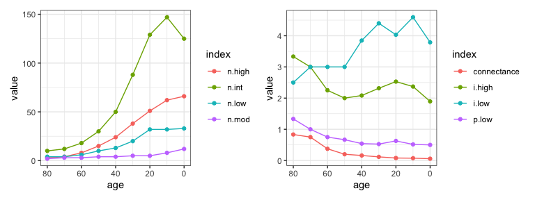
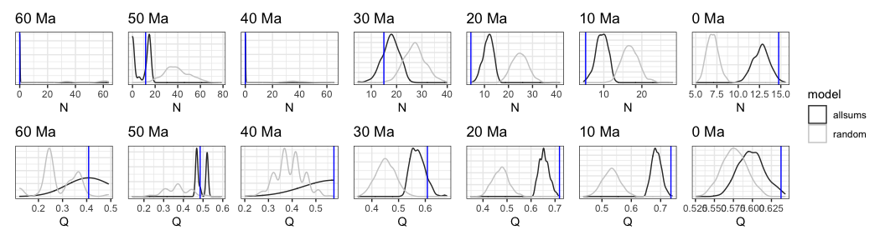

Pieridae host repertoire - network evolution
================
Mariana Braga
04 May, 2020

-----

Script 3 for empirical study performed in Braga et al. 2020 *Evolution
of butterfly-plant networks revealed by Bayesian inference of host
repertoire*.

This is a continuation of script 2 - Character history, so make sure you
complete that one first.

## Network size

First we will look at how network size changed over time in Pieridae.  
Let’s look at the number of butterflies and plants, the number of
interactions and modules. We can also calculate some ratios. Here we
have: *i.high* = mean number of interactions per butterfly, *i.low* =
mean number of interactions per host plant, *p.low* = number of hosts /
number of butterflies, and *connectance* = the proportion of possible
interactions that are realized.

``` r
net_size <- tibble()

for(i in 1:length(ages)){
  ns <- list_tgraphs[[i]] %>% activate(what = "nodes") %>% as_tibble()
  es <- list_tgraphs[[i]] %>% activate(what = "edges") %>% as_tibble()
  n.high <- length(which(ns$type == TRUE))
  n.low <- length(which(ns$type == FALSE))
  n.mod <- length(unique(ns$module))
  n.int <- nrow(es)
  net_size <- bind_rows(net_size, tibble(age=ages[i], 
                                         n.high=n.high, 
                                         n.low=n.low, 
                                         n.mod=n.mod, 
                                         n.int=n.int,
                                         i.high=n.int/n.high,
                                         i.low=n.int/n.low,
                                         p.low=n.low/n.high,
                                         connectance=n.int/(n.high*n.low)))
}

net_size <- pivot_longer(net_size, 2:9, names_to = "index", values_to = "value")
net_size_n <- filter(net_size, index %in% c("n.high","n.low","n.mod","n.int"))
net_size_r <- filter(net_size, index %in% c("i.high","i.low","p.low","connectance"))

gg_size_n <- ggplot(net_size_n, aes(age,value, col = index)) +
  geom_line() +
  geom_point() +
  scale_x_reverse() +
  theme_bw()

gg_size_r <- ggplot(net_size_r, aes(age,value, col = index)) +
  geom_line() +
  geom_point() +
  scale_x_reverse() +
  theme_bw()
```

``` r
gg_size_n + gg_size_r 
```

<!-- -->

## Network structure

### Null models

We are gonna generate networks using two null models. `r00` only keeps
the size and number of interactions of the original network, while
`r2dtable` also keeps the marginal sums, i.e. the number of interactions
that each butterfly/plant has.

``` r
# gotta skip network at 80 Ma because it only has one host
Nulls_r00 <- list()
Nulls_r2d <- list()

nit <- 1000

for(i in 2:length(ages)){
  null_r00 <- vegan::nullmodel(net_list[[i]], "r00") 
  sim_r00 <- simulate(null_r00, nsim=nit, seed = 1)
  Nulls_r00[[i]] <- sim_r00
  
  null_r2d <- vegan::nullmodel(net_list[[i]], "r2dtable") 
  sim_r2d <- simulate(null_r2d, nsim=nit, seed = 1)
  #null_r2d <- bipartite::nullmodel(count, N=nit, method=1)
  Nulls_r2d[[i]] <- sim_r2d
  
}  
```

### Modularity

Let’s calculate the modularity of each null network, except for 80, 70,
and 60 Ma. They are too small.

``` r
source("my_compute_module.R")  
```

``` r
Qnull <- tibble()

for(i in 3:length(ages)){

  sim_random <- Nulls_r00[[i]]
  sim_allsums <- Nulls_r2d[[i]]

  for(j in 1:nit){
    Qrandom <- mycomputeModules(sim_random[,,j])@likelihood
    Qallsums <- mycomputeModules(sim_allsums[,,j])@likelihood

    Qnull <- bind_rows(Qnull, tibble(age = ages[i], sim=j, allsums=Qallsums, random=Qrandom))
  }
}

Qnull <- Qnull %>% pivot_longer(3:4, names_to = "model", values_to = "Q")
```

``` r
Qnull <- readRDS("./networks/Qnull.rds")
    
# observed
Qobs <- tibble()

for(i in 3:length(ages)){
  q <- get(paste0("mod_",ages[i]))
  Qobs<- bind_rows(Qobs, tibble(age = ages[i], Q = q@likelihood))
}


# _Nestedness ----

# do not calculate for networks at 80 and 70 Ma. They are too small. 
Nnull <- tibble()

for(i in 3:length(ages)){
  
  sim_random <- Nulls_r00[[i]]
  sim_allsums <- Nulls_r2d[[i]]  
  
  for(j in 1:nit){
    Nrandom <- networklevel(sim_random[,,j],index="NODF")
    Nallsums <- networklevel(sim_allsums[,,j],index="NODF")
    Nnull <- bind_rows(Nnull, tibble(age = ages[i], sim=j, random=Nrandom, allsums=Nallsums))
  }
}

Nnull <- Nnull %>% pivot_longer(3:4, names_to = "model", values_to = "N")
```

``` r
Nnull <- readRDS("./networks/Nnull.rds")


# observed
Nobs <- tibble()

for(i in 3:length(ages)){
    nodf <- networklevel(net_list[[i]],index="NODF")
    Nobs<- bind_rows(Nobs, tibble(age = ages[i], nodf = nodf))
}


# _Density plots ----

# modularity
for(g in ages[3:9]){
  
  gg <- ggplot(filter(Qnull, age == g)) +
    geom_density(aes(Q, group = model, color = model)) +
    scale_color_grey() +
    geom_vline(xintercept = filter(Qobs, age == g)$Q, col = "blue") +
    labs(title = paste0(g," Ma"), y = NULL) +
    theme_bw() + 
    theme(axis.ticks.y = element_line(linetype = "blank"), 
          axis.text.y = element_blank())
  
  assign(paste0("mod_plot_",g), gg)
}

# nestedness
for(g in ages[3:9]){
  gg <- ggplot(filter(Nnull, age == g)) +
    geom_density(aes(N, group = model, color = model)) +
    scale_color_grey() +
    geom_vline(xintercept = filter(Nobs, age == g)$nodf, col = "blue") +
    labs(title = paste0(g," Ma"), y = NULL) +
    theme_bw() + 
    theme(axis.ticks.y = element_line(linetype = "blank"), 
          axis.text.y = element_blank())
  
  assign(paste0("nodf_plot_",g), gg)
}
```

``` r
(nodf_plot_60 / mod_plot_60 |
  nodf_plot_50 / mod_plot_50 |
  nodf_plot_40 / mod_plot_40 |
  nodf_plot_30 / mod_plot_30 |
  nodf_plot_20 / mod_plot_20 |
  nodf_plot_10 / mod_plot_10 |
  nodf_plot_0 / mod_plot_0) +
  plot_layout(guides = 'collect')
```

<!-- -->

``` r
# _Z-scores ----

Qzscore <- Qnull %>% 
  group_by(age, model) %>% 
  summarize(mean = mean(Q),
            sd = sd(Q)) %>% 
  left_join(Qobs) %>% 
  mutate(z = (Q - mean)/sd) %>% 
  left_join(Qnull %>% 
              left_join(rename(Qobs, Qobs = Q)) %>% 
              group_by(age, model) %>% 
              summarise(p = sum(Q > Qobs)/nit))
```

    ## Joining, by = "age"
    ## Joining, by = "age"

    ## Joining, by = c("age", "model")

``` r
Nzscore <- Nnull %>% 
  group_by(age, model) %>% 
  summarize(mean = mean(N),
            sd = sd(N)) %>% 
  left_join(Nobs) %>% 
  mutate(z = (nodf - mean)/sd) %>% 
  left_join(Nnull %>% 
              left_join(rename(Nobs, Nobs = nodf)) %>% 
              group_by(age, model) %>% 
              summarise(p = sum(N > Nobs)/nit))
```

    ## Joining, by = "age"

    ## Joining, by = "age"

    ## Joining, by = c("age", "model")

``` r
# colors from parameter estimates plot
palwes <- wes_palette("Zissou1", 4, type = "continuous")
pal <- c(palwes[4],palwes[1])

plot_qz <- ggplot(Qzscore) +
  geom_line(aes(age, z, group = model, col = model)) +
  geom_point(aes(age, z, group = model, col = model),
             data = filter(Qzscore, p <= 0.05),
             size = 2, alpha = 0.7) +
  scale_color_manual(values = pal) +
  scale_x_reverse() +
  labs(title = "Modularity, Q", y = "Z-score", x = "Millions of years ago, Ma", col = "Null model") +
  theme_bw()

plot_nz <- ggplot(Nzscore) +
  geom_line(aes(age, z, group = model, col = model)) +
  geom_point(aes(age, z, group = model, col = model),
             data = filter(Nzscore, p <= 0.05),
             size = 2, alpha = 0.7) +
  scale_color_manual(values = pal) +
  scale_x_reverse() +
  labs(title = "Nestedness, N", y = "Z-score", x = "Millions of years ago, Ma", col = "Null model") +
  theme_bw()
```

``` r
plot_qz / plot_nz + plot_layout(guides = 'collect')
```

<!-- -->

``` r
# Phylogenetic diversity ----

# _Butterflies ----

butterflies <- setdiff(all_mod_edited$name, host_tree$tip.label)
mod_matrix <- filter(all_mod_edited, name %in% butterflies) %>% 
  frame2webs(c("module","name","age"))

mod_matrix <- mod_matrix[rev(names(mod_matrix))]

list_but_pd <- list()
for(i in 2:length(ages)){
  bpd <- ses.pd(mod_matrix[[i]], list_subtrees[[i]], null.model="taxa.labels") 
  list_but_pd[[i]] <- bpd
}


# _Plants ----

mod_matrix_hosts <- filter(all_mod_edited, name %in% host_tree$tip.label) %>% 
  frame2webs(c("module","name","age"))

mod_matrix_hosts <- mod_matrix_hosts[rev(names(mod_matrix_hosts))]

list_host_pd <- list()
for(i in 2:length(ages)){
  
  out <- setdiff(host_tree$tip.label,colnames(mod_matrix_hosts[[i]]))
  host_subtree <- drop.tip(host_tree, out)
  ppd <- ses.pd(mod_matrix_hosts[[i]], host_subtree, null.model="taxa.labels") 
  list_host_pd[[i]] <- ppd
}


mod_pd <- tibble()
for(i in 2:length(ages)){
  age <- ages[i]
  ppd <- list_host_pd[[i]]
  bpd <- list_but_pd[[i]]
  
  btbl <- tibble(age=age, type="butterfly", module=rownames(bpd), 
                 PDz=bpd$pd.obs.z, PDp=bpd$pd.obs.p, ntaxa=bpd$ntaxa)
  ptbl <- tibble(age=age, type="plant", module=rownames(ppd), 
                 PDz=ppd$pd.obs.z, PDp=ppd$pd.obs.p, ntaxa=ppd$ntaxa)
  
  mod_pd <- bind_rows(mod_pd, btbl, ptbl)
}


gpdb <- ggplot(filter(mod_pd, type == "butterfly")) +
  geom_line(aes(age,PDz, group=factor(module, levels = mod_levels), 
                col=factor(module, levels = mod_levels))) +
  geom_point(aes(age,PDz, group=factor(module, levels = mod_levels), 
                 col=factor(module, levels = mod_levels)),
             data = filter(mod_pd, PDp <= 0.05, type == "butterfly"),
             size = 2) +
  scale_color_manual(values = custom_pal,na.value = "grey70", drop = F) +
  scale_x_reverse() +
  labs(title = "Butterflies", color = "Module", x = "Millions of years ago, Ma", y = "PD z-score") +
  theme_bw()

gpdp <- ggplot(filter(mod_pd, type == "plant")) +
  geom_line(aes(age,PDz, group=factor(module, levels = mod_levels), 
                col=factor(module, levels = mod_levels))) +
  geom_point(aes(age,PDz, group=factor(module, levels = mod_levels), 
                 col=factor(module, levels = mod_levels)),
             data = filter(mod_pd, PDp <= 0.05, type == "plant"),
             size = 2) +
  scale_color_manual(values = custom_pal,na.value = "grey70", drop = F) +
  scale_x_reverse() +
  labs(title = "Plants", color = "Module", x = "Millions of years ago, Ma", y = "PD z-score") +
  theme_bw()
```

``` r
gpdb / gpdp + plot_layout(guides = 'collect')
```

<!-- -->

``` r
# Number of nodes and modules through time ----

gnb <- ggplot() + 
  geom_point(data=filter(mod_pd, type == "butterfly"), 
             aes(age,ntaxa, col = factor(module, levels = mod_levels)),
             alpha = 0.7) + 
  geom_line(data=filter(mod_pd, type == "butterfly"),
            aes(age,ntaxa, col = factor(module, levels = mod_levels))) + 
  #geom_point(data=filter(mod_pd, type == "plant"), aes(age,ntaxa, col = factor(module, levels = mod_levels)), shape = "square") + 
  scale_color_manual(values = custom_pal,na.value = "grey70", drop = F) +
  #scale_shape_manual(values = c("square","circle")) +
  scale_x_reverse() +
  labs(color = "Module", x = "Millions of years ago, Ma", y = "Number of butterfly taxa") +
  theme_bw()
            
gnp <- ggplot() + 
  geom_point(data=filter(mod_pd, type == "plant"), 
              aes(age,ntaxa, col = factor(module, levels = mod_levels)),
              alpha = 0.7) + 
  geom_line(data=filter(mod_pd, type == "plant"),
            aes(age,ntaxa, col = factor(module, levels = mod_levels))) + 
  scale_color_manual(values = custom_pal,na.value = "grey70", drop = F) +
  scale_x_reverse() +
  labs(color = "Module", x = "Millions of years ago, Ma", y = "Number of plant taxa") +
  theme_bw()
```

``` r
gnb / gnp + plot_layout(guides = 'collect')
```

<!-- -->
