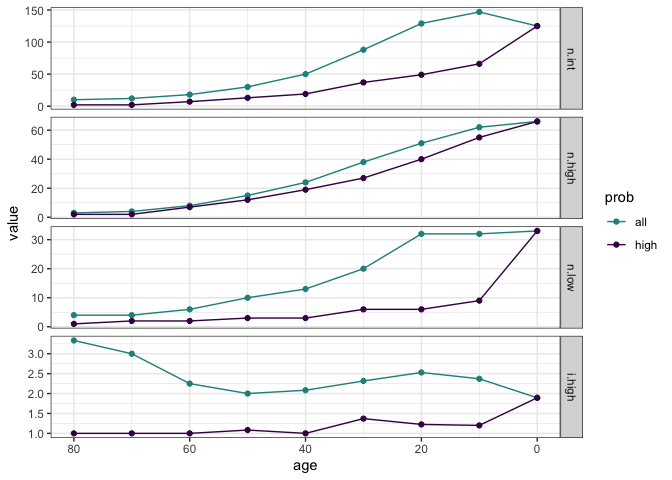
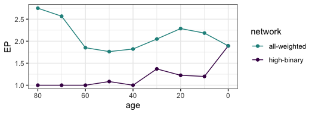
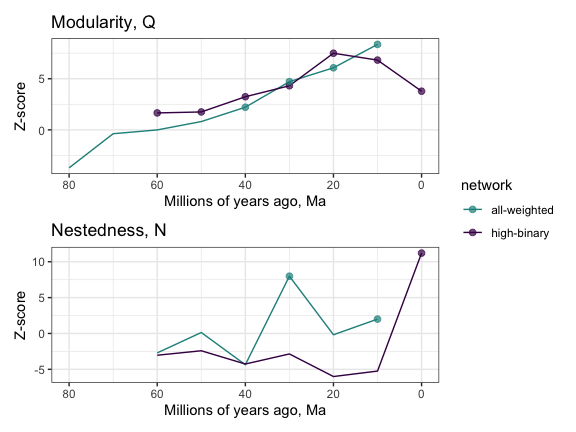
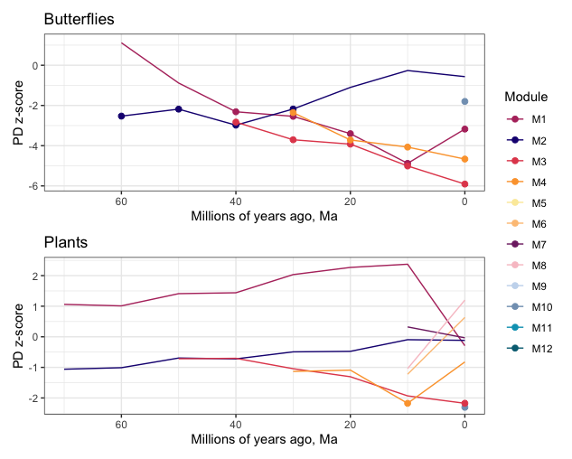
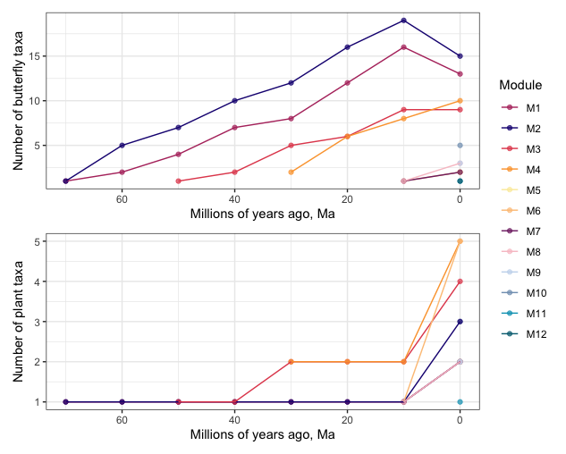

Pieridae host repertoire - network evolution
================
Mariana Braga
07 May, 2020

-----

Script 3 for empirical study performed in Braga et al. 2020 *Evolution
of butterfly-plant networks revealed by Bayesian inference of host
repertoire*.

This is a continuation of script 2 - Character history, so make sure you
complete that one first.

## Network size

First we will look at how network size changed over time in Pieridae.  
Let’s look at the number of butterflies and plants, the number of
interactions and modules. We can also calculate some ratios. Here we
have: *i.high* = mean number of interactions per butterfly, *i.low* =
mean number of interactions per host plant, *p.low* = number of hosts /
number of butterflies, and *connectance* = the proportion of possible
interactions that are realized.

``` r
net_size <- tibble()
net_size90 <- tibble()

for(i in 1:length(ages)){
  ns <- list_tgraphs[[i]] %>% activate(what = "nodes") %>% as_tibble()
  es <- list_tgraphs[[i]] %>% activate(what = "edges") %>% as_tibble()
  ns90 <- list_tgraphs[[i]] %>% activate(what = "nodes") %>% as_tibble() %>% filter(!is.na(module))
  es90 <- list_tgraphs[[i]] %>% activate(what = "edges") %>% as_tibble() %>% filter(weight >= 0.9)
  
  n.high <- length(which(ns$type == TRUE))
  n.low <- length(which(ns$type == FALSE))
  #n.mod <- length(unique(ns$module))
  n.int <- nrow(es)
  n90.high <- length(which(ns90$type == TRUE))
  n90.low <- length(which(ns90$type == FALSE))
  #n90.mod <- 
  n90.int <- nrow(es90)  
  
  net_size <- bind_rows(net_size, tibble(age=ages[i], 
                                         n.high=n.high, 
                                         n.low=n.low,
                                         n.int=n.int,
                                         i.high=n.int/n.high))
  
  net_size90 <- bind_rows(net_size90, tibble(age=ages[i],
                                           n.high=n90.high, 
                                           n.low=n90.low, 
                                           n.int=n90.int,
                                           i.high=n90.int/n90.high))
}

net_size <- pivot_longer(net_size, 2:5, names_to = "index", values_to = "value") %>% 
  mutate(prob = "all")
net_size90 <- pivot_longer(net_size90, 2:5, names_to = "index", values_to = "value") %>% 
  mutate(prob = "high")
net_size <- bind_rows(net_size,net_size90)

# 2-color palette
pal_2c <- viridis_pal()(3)[2:1]

ggplot(net_size, aes(age,value,col = prob)) +
  geom_line(aes(group=prob)) +
  geom_point() +
  scale_color_manual(values = pal_2c) +
  facet_grid(factor(index, levels = c("n.int","n.high","n.low","i.high"))~., scales = "free") +
  scale_x_reverse() +
  theme_bw()
```

<!-- -->

### Effective partners

``` r
net_ep <- tibble()

for(i in 1:length(ages)){
  
  net <- net_list[[i]]
  wnet <- list_wnets[[i]]
  
  m_ep <- mean(specieslevel(net, index = "effective partners", level = "higher")$effective.partners)
  mw_ep <- mean(specieslevel(wnet, index = "effective partners", level = "higher")$effective.partners)
  
  net_ep <- bind_rows(net_ep, tibble(age=ages[i], network = c('high-binary','all-weighted'), EP = c(m_ep, mw_ep)))
  
}
```

``` r
ggplot(net_ep, aes(age,EP,col = network)) +
  geom_line(aes(group=network)) +
  geom_point() +
  scale_color_manual(values = pal_2c) +
  scale_x_reverse() +
  theme_bw()
```

<!-- -->

## Network structure - Binary networks

### Null models

``` r
# number of null networks to be generated
nit <- 1000
```

``` r
Nulls_r00 <- list()
Nulls_r2d <- list()

# gotta skip network at 80 Ma because it only has one host
for(i in 2:length(ages)){
  null_r00 <- vegan::nullmodel(net_list[[i]], "r00") 
  sim_r00 <- simulate(null_r00, nsim=nit, seed = 1)
  Nulls_r00[[i]] <- sim_r00
  
  null_r2d <- vegan::nullmodel(net_list[[i]], "r2dtable") 
  sim_r2d <- simulate(null_r2d, nsim=nit, seed = 1)
  Nulls_r2d[[i]] <- sim_r2d
  
}  
```

### Modularity

Let’s calculate the modularity of each null network, except for 80, 70,
and 60 Ma. They are too small.

``` r
source("my_compute_module.R")  
```

``` r
Qnull <- tibble()

for(i in 3:length(ages)){

  sim_random <- Nulls_r00[[i]]
  sim_allsums <- Nulls_r2d[[i]]

  for(j in 1:nit){
    Qrandom <- mycomputeModules(sim_random[,,j])@likelihood
    Qallsums <- mycomputeModules(sim_allsums[,,j])@likelihood

    Qnull <- bind_rows(Qnull, tibble(age = ages[i], sim=j, allsums=Qallsums, random=Qrandom))
  }
}

Qnull <- Qnull %>% pivot_longer(3:4, names_to = "model", values_to = "Q")
```

``` r
# Modularity of binary null networks  
Qnull <- readRDS("./networks/Qnull.rds")

    
# observed
Qobs <- tibble()

for(i in 3:length(ages)){
  q <- get(paste0("mod_",ages[i]))
  Qobs<- bind_rows(Qobs, tibble(age = ages[i], Q = q@likelihood))
}


# _Nestedness ----
```

``` r
# do not calculate for networks at 80 and 70 Ma. They are too small. 
Nnull <- tibble()

for(i in 3:length(ages)){
  
  sim_random <- Nulls_r00[[i]]
  sim_allsums <- Nulls_r2d[[i]]  
  
  for(j in 1:nit){
    Nrandom <- networklevel(sim_random[,,j],index="NODF")
    Nallsums <- networklevel(sim_allsums[,,j],index="NODF")
    Nnull <- bind_rows(Nnull, tibble(age = ages[i], sim=j, random=Nrandom, allsums=Nallsums))
  }
}

Nnull <- Nnull %>% pivot_longer(3:4, names_to = "model", values_to = "N")
```

``` r
# Nestedness of binary null networks
Nnull <- readRDS("./networks/Nnull.rds")


# observed
Nobs <- tibble()

for(i in 3:length(ages)){
    nodf <- networklevel(net_list[[i]],index="NODF")
    Nobs<- bind_rows(Nobs, tibble(age = ages[i], nodf = nodf))
}
```

### Z-scores

``` r
Qzscore <- Qnull %>% 
  group_by(age, model) %>% 
  summarize(mean = mean(Q),
            sd = sd(Q)) %>% 
  left_join(Qobs) %>% 
  mutate(z = (Q - mean)/sd) %>% 
  left_join(Qnull %>% 
              left_join(rename(Qobs, Qobs = Q)) %>% 
              group_by(age, model) %>% 
              summarise(p = sum(Q > Qobs)/nit))
```

    ## Joining, by = "age"
    ## Joining, by = "age"

    ## Joining, by = c("age", "model")

``` r
Nzscore <- Nnull %>% 
  group_by(age, model) %>% 
  summarize(mean = mean(N),
            sd = sd(N)) %>% 
  left_join(Nobs) %>% 
  mutate(z = (nodf - mean)/sd) %>% 
  left_join(Nnull %>% 
              left_join(rename(Nobs, Nobs = nodf)) %>% 
              group_by(age, model) %>% 
              summarise(p = sum(N > Nobs)/nit))
```

    ## Joining, by = "age"

    ## Joining, by = "age"

    ## Joining, by = c("age", "model")

## Network structure - Weighted networks

### Null models

``` r
Nulls_rb <- list()
#Nulls_colsums <- list()
#Nulls_allsums <- list()

nit <- 1000

for(i in 1:(length(ages)-1)){
  
  count <- round(list_wnets[[i]]*100)
  
  null_rb <- vegan::nullmodel(count, "r00_both") 
  sim_rb <- simulate(null_rb, nsim=nit, seed = 1)
  Nulls_rb[[i]] <- sim_rb
  
  # null_c0 <- vegan::nullmodel(count, "c0_both") 
  # sim_c0 <- simulate(null_c0, nsim=nit, seed = 1)
  # Nulls_colsums[[i]] <- sim_c0
  
  # null_swap <- vegan::nullmodel(count, "quasiswap_count") 
  # sim_swap <- simulate(null_swap, nsim=nit, seed = 1)
  # Nulls_allsums[[i]] <- sim_swap
  
} 
```

### Modularity

``` r
Qwnull <- tibble()

for(i in 1:(length(ages)-1)){
  
  simw_random <- Nulls_rb[[i]]

  for(j in 1:nit){
    Qwrandom <- computeModules(simw_random[,,j])@likelihood
    Qwnull <- bind_rows(Qwnull, tibble(age = ages[i], sim=j, random=Qwrandom))
  }
}

Qwnull <- Qwnull %>% pivot_longer(3, names_to = "model", values_to = "Q")
```

``` r
# Modularity of weighted null networks 
Qwnull <- readRDS("./networks/Qwnull.rds")
```

### Nestedness

``` r
Nwnull <- tibble()

for(i in 1:(length(ages)-1)){
  
  sim_rb <- Nulls_rb[[i]]

  for(j in 1:nit){
    Nrb <- networklevel(sim_rb[,,j],index="weighted NODF")

    Nwnull <- bind_rows(Nwnull, tibble(age = ages[i], sim=j,random=Nrb))
  }
}

Nwnull <- Nwnull %>% pivot_longer(3, names_to = "model", values_to = "N")
```

``` r
# Nestedness of weighted null networks
Nwnull <- readRDS("./networks/Nwnull.rds")
```

### Z-scores

``` r
Qwzscore <- Qwnull %>%
  group_by(age, model) %>%
  summarize(mean = mean(Q),
            sd = sd(Q)) %>%
  left_join(Qobs) %>%
  mutate(z = (Q - mean)/sd) %>%
  left_join(Qwnull %>%
              left_join(rename(Qobs, Qobs = Q)) %>%
              group_by(age, model) %>%
              summarise(p = sum(Q > Qobs)/nit))
```

    ## Joining, by = "age"
    ## Joining, by = "age"

    ## Joining, by = c("age", "model")

``` r
Nwzscore <- Nwnull %>% 
  group_by(age, model) %>% 
  summarize(mean = mean(N),
            sd = sd(N)) %>% 
  left_join(Nobs) %>% 
  mutate(z = (nodf - mean)/sd) %>% 
  left_join(Nwnull %>% 
              left_join(rename(Nobs, Nobs = nodf)) %>% 
              group_by(age, model) %>% 
              summarise(p = sum(N > Nobs)/nit))
```

    ## Joining, by = "age"

    ## Joining, by = "age"

    ## Joining, by = c("age", "model")

``` r
Qz <- bind_rows(filter(Qzscore, model == 'random') %>% mutate(network = 'high-binary'), 
                filter(Qwzscore, model == 'random')%>% mutate(network = 'all-weighted'))

Nz <- bind_rows(filter(Nzscore, model == 'random') %>% mutate(network = 'high-binary'), 
                filter(Nwzscore, model == 'random')%>% mutate(network = 'all-weighted'))

plot_qz <- ggplot(Qz) +
  geom_line(aes(age, z, group = network, col = network)) +
  geom_point(aes(age, z, group = network, col = network),
             data = filter(Qz, p <= 0.05),
             size = 2, alpha = 0.7) +
  scale_color_manual(values = pal_2c) +
  scale_x_reverse() +
  labs(title = "Modularity, Q", y = "Z-score", x = "Millions of years ago, Ma") +
  theme_bw()

plot_nz <- ggplot(Nz) +
  geom_line(aes(age, z, group = network, col = network)) +
  geom_point(aes(age, z, group = network, col = network),
             data = filter(Nz, p <= 0.05),
             size = 2, alpha = 0.7) +
  scale_color_manual(values = pal_2c) +
  scale_x_reverse() +
  labs(title = "Nestedness, N", y = "Z-score", x = "Millions of years ago, Ma") +
  theme_bw()
```

``` r
plot_qz / plot_nz + plot_layout(guides = 'collect')
```

<!-- -->

``` r
# Phylogenetic diversity ----

# _Butterflies ----

butterflies <- setdiff(all_mod_edited$name, host_tree$tip.label)
mod_matrix <- filter(all_mod_edited, name %in% butterflies) %>% 
  frame2webs(c("module","name","age"))

mod_matrix <- mod_matrix[rev(names(mod_matrix))]

list_but_pd <- list()
for(i in 2:length(ages)){
  bpd <- ses.pd(mod_matrix[[i]], list_subtrees[[i]], null.model="taxa.labels") 
  list_but_pd[[i]] <- bpd
}


# _Plants ----

mod_matrix_hosts <- filter(all_mod_edited, name %in% host_tree$tip.label) %>% 
  frame2webs(c("module","name","age"))

mod_matrix_hosts <- mod_matrix_hosts[rev(names(mod_matrix_hosts))]

list_host_pd <- list()
for(i in 2:length(ages)){
  
  out <- setdiff(host_tree$tip.label,colnames(mod_matrix_hosts[[i]]))
  host_subtree <- drop.tip(host_tree, out)
  ppd <- ses.pd(mod_matrix_hosts[[i]], host_subtree, null.model="taxa.labels") 
  list_host_pd[[i]] <- ppd
}


mod_pd <- tibble()
for(i in 2:length(ages)){
  age <- ages[i]
  ppd <- list_host_pd[[i]]
  bpd <- list_but_pd[[i]]
  
  btbl <- tibble(age=age, type="butterfly", module=rownames(bpd), 
                 PDz=bpd$pd.obs.z, PDp=bpd$pd.obs.p, ntaxa=bpd$ntaxa)
  ptbl <- tibble(age=age, type="plant", module=rownames(ppd), 
                 PDz=ppd$pd.obs.z, PDp=ppd$pd.obs.p, ntaxa=ppd$ntaxa)
  
  mod_pd <- bind_rows(mod_pd, btbl, ptbl)
}


gpdb <- ggplot(filter(mod_pd, type == "butterfly")) +
  geom_line(aes(age,PDz, group=factor(module, levels = mod_levels), 
                col=factor(module, levels = mod_levels))) +
  geom_point(aes(age,PDz, group=factor(module, levels = mod_levels), 
                 col=factor(module, levels = mod_levels)),
             data = filter(mod_pd, PDp <= 0.05, type == "butterfly"),
             size = 2) +
  scale_color_manual(values = custom_pal,na.value = "grey70", drop = F) +
  scale_x_reverse() +
  labs(title = "Butterflies", color = "Module", x = "Millions of years ago, Ma", y = "PD z-score") +
  theme_bw()

gpdp <- ggplot(filter(mod_pd, type == "plant")) +
  geom_line(aes(age,PDz, group=factor(module, levels = mod_levels), 
                col=factor(module, levels = mod_levels))) +
  geom_point(aes(age,PDz, group=factor(module, levels = mod_levels), 
                 col=factor(module, levels = mod_levels)),
             data = filter(mod_pd, PDp <= 0.05, type == "plant"),
             size = 2) +
  scale_color_manual(values = custom_pal,na.value = "grey70", drop = F) +
  scale_x_reverse() +
  labs(title = "Plants", color = "Module", x = "Millions of years ago, Ma", y = "PD z-score") +
  theme_bw()
```

``` r
gpdb / gpdp + plot_layout(guides = 'collect')
```

<!-- -->

``` r
# Number of nodes and modules through time ----

gnb <- ggplot() + 
  geom_point(data=filter(mod_pd, type == "butterfly"), 
             aes(age,ntaxa, col = factor(module, levels = mod_levels)),
             alpha = 0.7) + 
  geom_line(data=filter(mod_pd, type == "butterfly"),
            aes(age,ntaxa, col = factor(module, levels = mod_levels))) + 
  #geom_point(data=filter(mod_pd, type == "plant"), aes(age,ntaxa, col = factor(module, levels = mod_levels)), shape = "square") + 
  scale_color_manual(values = custom_pal,na.value = "grey70", drop = F) +
  #scale_shape_manual(values = c("square","circle")) +
  scale_x_reverse() +
  labs(color = "Module", x = "Millions of years ago, Ma", y = "Number of butterfly taxa") +
  theme_bw()
            
gnp <- ggplot() + 
  geom_point(data=filter(mod_pd, type == "plant"), 
              aes(age,ntaxa, col = factor(module, levels = mod_levels)),
              alpha = 0.7) + 
  geom_line(data=filter(mod_pd, type == "plant"),
            aes(age,ntaxa, col = factor(module, levels = mod_levels))) + 
  scale_color_manual(values = custom_pal,na.value = "grey70", drop = F) +
  scale_x_reverse() +
  labs(color = "Module", x = "Millions of years ago, Ma", y = "Number of plant taxa") +
  theme_bw()
```

``` r
gnb / gnp + plot_layout(guides = 'collect')
```

<!-- -->
