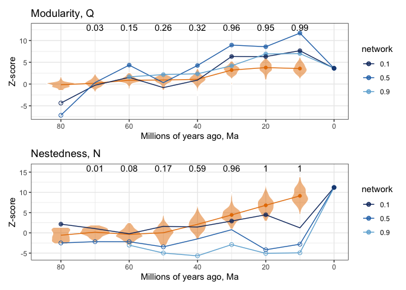
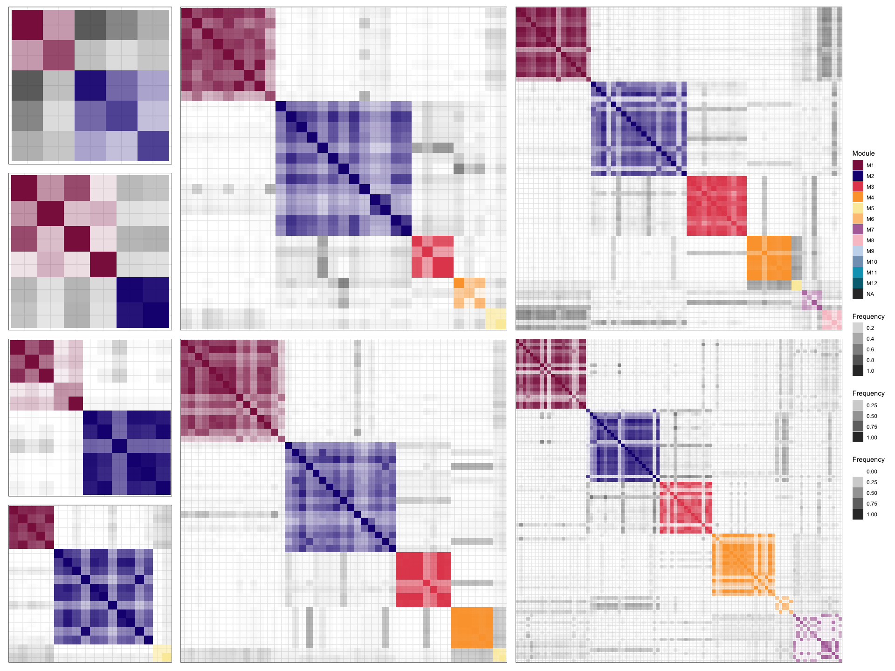

Pieridae host repertoire - Sampled networks
================
Mariana Braga
09 July, 2021

------------------------------------------------------------------------

Script 4 for analyses performed in Braga et al. 2021 *Phylogenetic
reconstruction of ancestral ecological networks through time for pierid
butterflies and their host plants*, Ecology Letters.

### Sampled networks

In this last script we will estimate the posterior distribution for
modularity and nestedness directly from the sampled networks during
MCMC.

The first step then is to retrieve these networks from the inferred
character history.

``` r
# Read in necessary files: trees and character history
tree <- read.tree("./data/tree_nodelab.tre")
host_tree <- read.tree("./data/angio_pie_50tips_ladder.phy")

history_bl1 <- evolnets::read_history('./inference/out.3.bl1.pieridae.2s.history.txt') %>% 
  dplyr::filter(iteration > 20000)
```

We don’t need to get a network for every iteration of the MCMC, so let’s
thin out `history_bl1` first.

``` r
# Get 100 samples
it_seq <- seq(20000,200000, 1800)  
history <- filter(history_bl1, iteration %in% it_seq[-1])
nsamp <- length(unique(history$iteration))

# get samples at ages
ages <- seq(80,10,-10)
samples_ages <- evolnets::posterior_at_ages(history, ages, tree, host_tree)[[1]]
```

Then, calculate z-scores for nestedness and modularity for each sampled
network.

``` r
# slow!
# nestedness of samples
Nz_samples <- index_at_ages(samples_ages, ages, index = "NODF", null = 100, seed = 2)
```

``` r
# even slower! - you can try with a lower number of null networks first, e.g. null = 3
# modularity of samples
Qz_samples <- index_at_ages(samples_ages, ages, index = "Q", null = 100, seed = 5)
```

``` r
# read it in instead
Nz_samples <- readRDS("./networks/Nz_samples.rds")
Qz_samples <- readRDS("./networks/Qz_samples.rds")
```

**Posterior probability of significance**

We summarized the statistical significance of the network structures
among samples with the proportion of sampled networks that are
significantly more nested/modular than expected by chance.

``` r
ppN <- Nz_samples %>% 
  group_by(age) %>% 
  filter(p <= 0.05) %>% 
  summarise(pp = n()/nsamp) %>% 
  mutate(y = 16) # just for placement in the plot
  
ppQ <- Qz_samples %>% 
 group_by(age) %>% 
 filter(p <= 0.05) %>% 
 summarise(pp = n()/nsamp)  %>% 
  mutate(y = 13)
```

### Plot Z-scores for extant, sampled and summary networks

Read z-scores for all three summary networks (done in script 3)

``` r
Qz <- readRDS("./networks/Qz.rds")
Nz <- readRDS("./networks/Nz.rds")
```

Now we can plot all z-scores across ages (Fig. 2 in the paper)

``` r
pal_3c <- brewer.pal(n = 9, name = 'Blues')[c(9,7,5)]
wes_orange <- wes_palette("Zissou1",7, type = "continuous")[6]

violN <- ggplot(Nz) +
  geom_violin(aes(age, z, group = age), col = "white", fill = wes_orange, alpha = 0.5, data = Nz_samples) +
  stat_summary(aes(age, z), fun = "mean", geom = "line", col = wes_orange, data = Nz_samples) +
  stat_summary(aes(age, z), fun = "mean", geom = "point", col = wes_orange, data = filter(Nz_samples, age < 40)) +
  geom_text(aes(age, y, label = pp), data = ppN) +
  geom_line(aes(age, z, group = network, col = network)) +
  geom_point(aes(age, z, group = network, col = network),
             data = filter(Nz, p <= 0.05),
             size = 2, alpha = 0.7) +
  geom_point(aes(age, z, group = network, col = network),
             data = filter(Nz, p >= 0.95),
             size = 2, shape = 1) +
  scale_color_manual(values = pal_3c) +
  scale_x_reverse() +
  labs(title = "Nestedness, N", y = "Z-score", x = "Millions of years ago, Ma") +
  theme_bw()

violQ <- ggplot(Qz) +
  geom_violin(aes(age, z, group = age), col = "white", fill = wes_orange, alpha = 0.5, data = Qz_samples) +
  stat_summary(aes(age, z), fun = "mean", geom = "line", col = wes_orange, data = Qz_samples) +
  stat_summary(aes(age, z), fun = "mean", geom = "point", col = wes_orange, data = filter(Qz_samples, age < 40)) +
  geom_text(aes(age, y, label = pp), data = ppQ) +
  geom_line(aes(age, z, group = network, col = network)) +
  geom_point(aes(age, z, group = network, col = network),
             data = filter(Qz, p <= 0.05),
             size = 2, alpha = 0.7) +
  geom_point(aes(age, z, group = network, col = network),
             data = filter(Qz, p >= 0.95),
             size = 2, shape = 1) +
  scale_color_manual(values = pal_3c) +
  scale_x_reverse() +
  labs(title = "Modularity, Q", y = "Z-score", x = "Millions of years ago, Ma") +
  theme_bw()

violQ / violN
```

<!-- -->

### Pairwise module membership

To be able to calculate the probability that 2 nodes belong to the same
module, we have to get the information about module assignment while
calculating modularity. This function is not implemented in `evolnets`
yet, so we’ll do it with more lines of code.

``` r
# slow!
# Calculate Q for sampled networks AND save modules
Qsamples <- tibble()
Mod_samples <- tibble()

for(a in 1:(length(ages)-1)){
  for(i in 1:nsamp){
    net <- samples_ages[[a]][i,,]
    set.seed(2)                   
    mod <- mycomputeModules(net)
    
    q <- mod@likelihood
    Qsamples <- bind_rows(Qsamples, tibble(age = ages[a], sample = i, Q=q))
    
    mod_list <- listModuleInformation(mod)[[2]]
    nmod <- length(mod_list)
    for(m in 1:nmod){
      members <- unlist(mod_list[[m]])
      mtbl <- tibble(name = members, 
                     age = rep(ages[a], length(members)),
                     sample = rep(i, length(members)),
                     original_module = rep(m, length(members)))
      
      Mod_samples <- bind_rows(Mod_samples, mtbl)
    }
  }
}
```

This produces one tibble with Q values and another with the module
information. Now, we only need the latter:

``` r
# shortcut  
Mod_samples <- readRDS("./networks/Mod_samples.rds")
```

Before we continue, we need to remove the sampled networks that are
fully connected and, because of that, produce spurious modules.

``` r
# Find sampled networks at 80Ma that got several modules with the same hosts (connectance = 1)
out <- Mod_samples %>% group_by(age, sample) %>% distinct(name) %>% summarize(u=n()) %>% 
  left_join(Mod_samples %>% group_by(age, sample) %>% summarize(n=n())) %>% 
  mutate(problem = case_when(u != n ~ "YES", u == n ~ "NO")) %>% 
  filter(problem == "YES")

good_samples_at_80 <- setdiff(1:100,out$sample)
```

Calculate pairwise module membership

``` r
# slow!
pair_mod_matrix <- list() # for heatmap from a matrix
pair_mod_tbl <- list()    # for heatmap from an edge list

for(a in 1:length(ages)){
  taxa = Mod_samples %>% filter(age == ages[a]) %>% distinct(name)
  ntaxa = nrow(taxa)
  
  heat <- matrix(data=0, nrow = ntaxa, ncol = ntaxa)
  rownames(heat) <- colnames(heat) <- taxa$name
  
  tbl <- tibble(row = taxa$name, col = taxa$name) %>% 
    complete(row,col) %>% 
    mutate(freq = 0)
  
  for(i in 1:nsamp){
    
    if(a == 1){
      if(i %in% good_samples_at_80){
        table <- Mod_samples %>% filter(age == ages[a], sample == i)
        mods <- unique(table$original_module)
        
        for(m in 1:length(mods)){
          module <- filter(table, original_module == m)
          
          for(r in 1:nrow(heat)){
            for(c in 1:ncol(heat)){
              if(rownames(heat)[r] %in% module$name & colnames(heat)[c] %in% module$name){
                heat[r,c] = heat[r,c] + 1
                tbl <- mutate(tbl, freq = case_when(row == rownames(heat)[r] & col == colnames(heat)[c] ~ freq + 1,
                                                    TRUE ~ freq))
              }
            }
          }
        }
      }
      
    } else{
      table <- Mod_samples %>% filter(age == ages[a], sample == i)
      mods <- unique(table$original_module)
      
      for(m in 1:length(mods)){
        module <- filter(table, original_module == m)
        
        for(r in 1:nrow(heat)){
          for(c in 1:ncol(heat)){
            if(rownames(heat)[r] %in% module$name & colnames(heat)[c] %in% module$name){
              heat[r,c] = heat[r,c] + 1
              tbl <- mutate(tbl, freq = case_when(row == rownames(heat)[r] & col == colnames(heat)[c] ~ freq + 1,
                                                  TRUE ~ freq))
            }
          }
        }
      }
    }
  }
  pair_mod_matrix[[a]] <- heat
  pair_mod_tbl[[a]] <- tbl
}
```

``` r
# shortcut
pair_mod_tbl <- readRDS("./networks/pair_mod_tbl.rds")


# Add module information to plot with ggplot2

all_wmod50_edited <- read.csv("./networks/all_wmod50_bl1.csv", header = T, stringsAsFactors = F)

wmod_levels50 <- c(paste0('M',1:12))
custom_palw50 <- c("#8a1c4c","#1b1581","#e34c5b","#fca33a","#fbeba9","#fdc486",
                 "#b370a8","#f8c4cc","#c8d9ee","#82a0be","#00a2bf","#006e82")


# Loop across all ages

for(i in 1:length(ages)){
  
  edge_list <- as_tibble(pair_mod_tbl[[i]]) %>%
  inner_join(all_wmod50_edited %>% filter(age == ages[i]) %>% select(name, module), by = c("row" = "name")) %>%
  inner_join(all_wmod50_edited %>% filter(age == ages[i]) %>% select(name, module), by = c("col" = "name")) %>%
  mutate(Module = ifelse(module.x == module.y, module.x, NA),
         Frequency = freq/max(freq)) 

  order <- edge_list %>% arrange(module.x) %>% pull(row) %>% unique()

  plot_net <- edge_list %>% mutate(
   row = factor(row, levels = order),
   col = factor(col, levels = order))
  
  gg <- ggplot(plot_net, aes(x = row, y = reorder(col,desc(col)), fill = factor(Module, levels = wmod_levels50), alpha = Frequency)) +
  geom_tile() +
  theme_bw() +
  scale_x_discrete(drop = FALSE) +
  scale_y_discrete(drop = FALSE) +
  scale_fill_manual(values = custom_palw50, na.value = "grey20", drop = F) +
  scale_alpha(range = c(min(edge_list$Frequency),max(edge_list$Frequency))) +
  labs(fill = "Module") +
  theme(
    axis.text = element_blank(),     
    axis.ticks = element_blank(),
    axis.title.x = element_blank(),
    axis.title.y = element_blank())
  
  assign(paste0("heat_mod50_",ages[[i]]), gg)
}


# define layout
design <- c(patchwork::area(1,1,1,1),
            patchwork::area(2,1,2,1),
            patchwork::area(3,1,3,1),
            patchwork::area(4,1,4,1),
            patchwork::area(1,2,2,3),
            patchwork::area(3,2,4,3),
            patchwork::area(1,4,2,5),
            patchwork::area(3,4,4,5))
```

``` r
# plot!
heat_mod50_80 +
  heat_mod50_70 + 
  heat_mod50_60 + 
  heat_mod50_50 + 
  heat_mod50_40 + 
  heat_mod50_30 + 
  heat_mod50_20 + 
  heat_mod50_10 + 
  plot_layout(guides = 'collect', design = design)
```

<!-- -->

And that is it!
