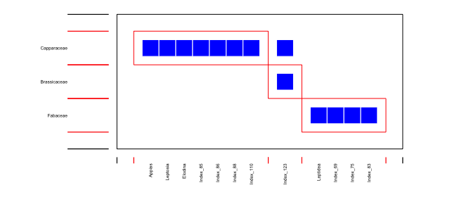
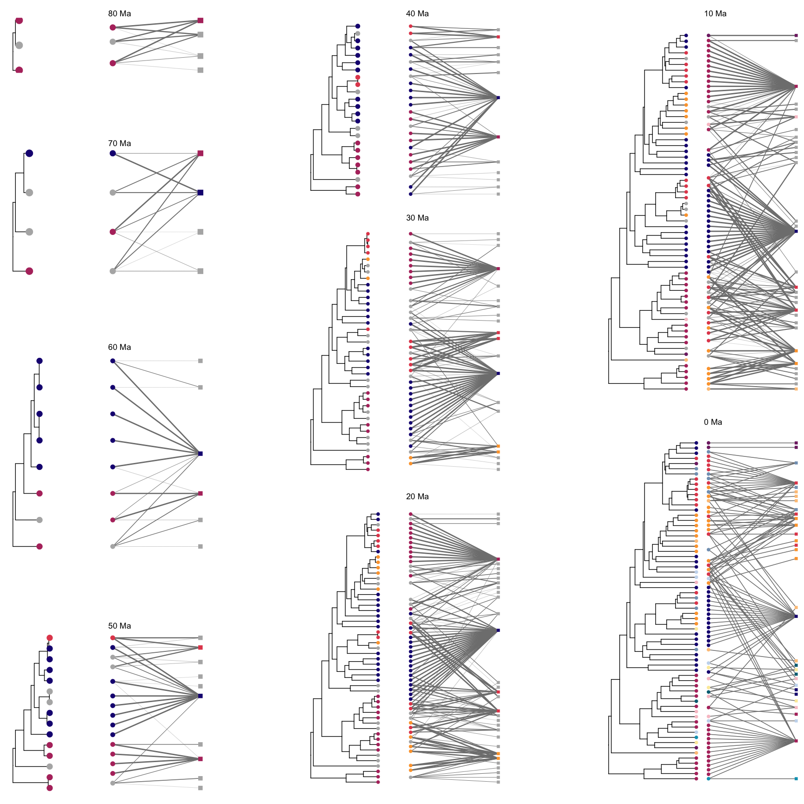
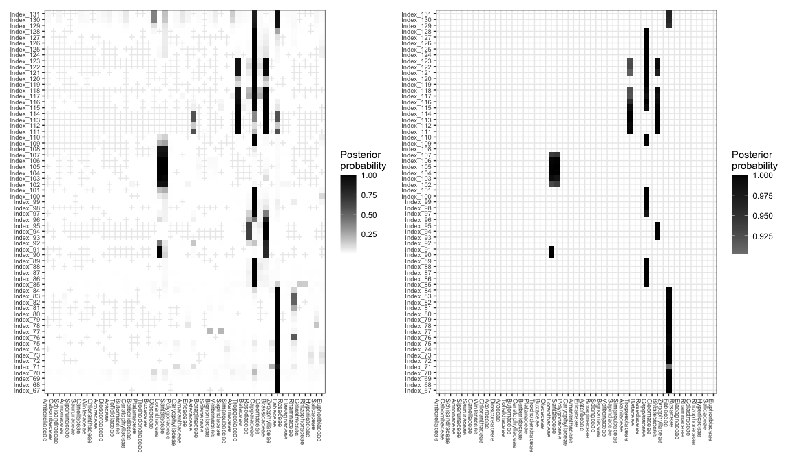

Pieridae host repertoire - character history
================
Mariana Braga
02 May, 2020

-----

Script 2 for empirical study performed in Braga et al. 2020 *Evolution
of butterfly-plant networks revealed by Bayesian inference of host
repertoire*.

## Data

First we read in the phylogenetic trees for butterflies and plants.
Then, we read in the interaction matrix and remove plants (rows) that
are not hosts to any butterfly.

**Trees**

``` r
tree <- read.tree("./data/bphy_pie_ladder.phy")
host_tree <- read.tree("./data/angio_pie_50tips_ladder.phy")
```

**Extant network**

``` r
ext_net_50h <- as.matrix(read.csv("./data/incidence_pieridae.csv", header = T, row.names = 1))
identical(colnames(ext_net_50h), tree$tip.label)
identical(rownames(ext_net_50h), host_tree$tip.label)
```

``` r
ext_net <- ext_net_50h[which(rowSums(ext_net_50h) != 0),]
dim(ext_net)
```

    ## [1] 33 66

## Character history

**Read in .history.txt files**

These files can get quite big, so I can’t upload them in Github. Also,
you might want to thin out these files to speed up their parsing. This
is how you can do it.

(Note that in the analyses in the paper we did not thin the histories,
so we’ll show results with all sampled histories).

``` r
colclasses <- c(rep("numeric",7),"character","character","numeric","character",rep("numeric",3))
```

``` r
history_dat_time = read.table("./inference/out.2.real.pieridae.2s.history.txt", sep="\t", header=T, colClasses = colclasses)
 
# define burnin and sampling interval  
it_seq <- seq(20000,200000, 100)  

# Time-calibrated tree
history_dat_time <- filter(history_dat_time, iteration %in% it_seq) %>% 
  mutate(node_index = node_index + 1)

write.table(history_dat_time,"./inference/history.time.txt", sep="\t", quote = F, row.names = F)

# Tree with branch lengths = 1
history_dat_bl1 = read.table("./inference/out.3.bl1.pieridae.2s.history.txt", sep="\t", header=T, colClasses = colclasses)

history_dat_bl1 <- filter(history_dat_bl1, iteration %in% it_seq) %>% 
  mutate(node_index = node_index + 1)

write.table(history_dat_bl1,"./inference/history.bl1.txt", sep="\t", quote = F, row.names = F)
```

The next time you run this script you just need to read in the thinned
histories. One file with sampled histories when using the
time-cklibrated host tree, and one using the transformed host tree (all
branch lengths = 1).

``` r
history_dat_time = read.table("./inference/history.time.txt", sep="\t", header=T, colClasses = colclasses)
history_dat_bl1 = read.table("./inference/history.bl1.txt", sep="\t", header=T, colClasses = colclasses)
```

### Effective rate of evolution

``` r
tree_length <- sum(tree$edge.length)+86
n_events_time <- group_by(history_dat_time,iteration) %>% 
  summarise(n = n()) %>% 
  summarise(mean = mean(n)) %>% 
  pull(mean)
n_events_bl1 <- group_by(history_dat_bl1,iteration) %>% 
  summarise(n = n()) %>% 
  summarise(mean = mean(n)) %>% 
  pull(mean)

(rate_time <- n_events_time/tree_length)
```

    ## [1] 0.09766287

``` r
(rate_bl1 <- n_events_bl1/tree_length)
```

    ## [1] 0.09510045

In both analyses, the rate of host repertoire evolution was near 1 event
every 10 Myr (along each branch).

### Ancestral networks

**(at given ages)**

First load the script `functions_ancestral_states.R` which contains the
functions to calculate the posterior probabilities for each
plant-butterfly interaction at given times in the past.

``` r
source("functions_ancestral_states.R")
```

Then choose the times in the past at which you want to reconstruct the
network.

``` r
ages = c(80,70,60,50,40,30,20,10,0)
```

This part is slow, so I won’t run it here.

``` r
list_m_at_ages = list()
for (i in 1:(length(ages)-1)) {
  age = ages[i]
  list_m_at_ages[[i]] = t(make_matrix_at_age( history_dat_time, age, s_hit=c(2) ))
}
```

I have done this before and saved the list as a .rds file.

``` r
list_m_at_ages <- readRDS("./inference/list_m_at_ages_time.rds")
  
length(list_m_at_ages)
```

    ## [1] 8

``` r
head(list_m_at_ages[[1]])
```

    ##                Pseudopontia    Index_70   Index_129
    ## Amborellaceae   0.002499306 0.003610108 0.001666204
    ## Cabombaceae     0.006942516 0.011108026 0.004443210
    ## Schisandraceae  0.015551236 0.021938350 0.010552624
    ## Annonaceae      0.021938350 0.030824771 0.020549847
    ## Siparunaceae    0.017772841 0.031380172 0.016106637
    ## Saururaceae     0.011385726 0.026103860 0.009997223

Then we add the extant network in the list with all ancestral networks.

``` r
list_m_at_ages[[9]] <- ext_net
```

We can build two kinds of ancestral networks, binary and quantitative.
For binary networks, we need to choose a probability threshold above
which we consider the interaction has enough support. Interactions above
the threshold are coded as 1, and the remaining interactions are coded
as 0. For now, we’ll do only binary networks.

#### Binary networks

**(with a probability threshold)**

After defining the probability threshold, we transform the probabilities
into 1s and 0s.

``` r
# probability threshold
pt <- 90 
# gather networks in a list
net_list <- list()
for(m in 1:length(list_m_at_ages)){
  matrix <- list_m_at_ages[[m]]
  for(i in 1:nrow(matrix)){
    for(j in 1:ncol(matrix)){
      if(matrix[i,j] < pt/100){
        matrix[i,j] = 0
      } else{
        matrix[i,j] = 1
      }
    }
  }
  df <- as.data.frame(matrix) # so that it doesn't become a vector
  df = df[ rowSums(df)!=0, ]  # if only one row/column is left
  df = df[ ,colSums(df)!=0 ]
  net_list[[m]] <- df
}

net_list[[1]]
```

    ##          Pseudopontia Index_70 Index_129
    ## Fabaceae            1        1         1

#### Calculate modularity

(stochastic step\!)

This doesn’t work for the network at 80Ma because it only has one host,
so we add it manually before calculating for the other networks.

``` r
all_mod <- tibble(name = c(rownames(net_list[[1]]),colnames(net_list[[1]])), 
                  age = 80,
                  original_module = 1)

for(i in 2:length(net_list)){
  set.seed(5)
  mod <- computeModules(net_list[[i]])
  assign(paste0("mod_",ages[i]),mod)
  mod_list <- listModuleInformation(mod)[[2]]
  nmod <- length(mod_list)
  
  for(m in 1:nmod){
    members <- unlist(mod_list[[m]])
    mtbl <- tibble(name = members, 
                   age = rep(ages[i], length(members)),
                   original_module = rep(m, length(members)))
    
    all_mod <- bind_rows(all_mod, mtbl)
  }
}
```

``` r
# check modules for some network
plotModuleWeb(mod_40, labsize = 0.4)
```

<!-- -->

#### Make tidygraphs with module information

Get weighted graph from list\_m\_at\_ages after setting minimum weight

``` r
minp <- 10

list_tgraphs <- list()
for(n in 1:length(net_list)){
  wnet <- list_m_at_ages[[n]]
  for(i in 1:nrow(wnet)){
    for(j in 1:ncol(wnet)){
      if(wnet[i,j] < minp/100){
        wnet[i,j] = 0
      }
    }
  }
  wnet = wnet[ rowSums(wnet)!=0, ]
  wnet = wnet[ ,colSums(wnet)!=0 ]
  
  wgraph <- as_tbl_graph(wnet, directed = F) %>% 
    left_join(filter(all_mod, age == ages[n]), by = "name") %>% 
    select(type, name, original_module)

  list_tgraphs[[n]] <- wgraph
}
```

**Match modules across ages**

I modified `all_mod` outside R to match the modules, so that all modules
across ages containing, for example, Fabaceae, have the same name. Then
I read it in as `all_mod_edited` and fixed the information in the
tidygraphs.

``` r
all_mod_edited <- read.csv("all_mod_time.csv", header = T, stringsAsFactors = F)
for(n in 1:length(ages)){
  list_tgraphs[[n]] <- list_tgraphs[[n]] %>% 
    activate(what = "nodes") %>% 
    left_join(filter(all_mod_edited, age == ages[n]) %>% select(name, module), by = "name")
}
```

#### Make tree for each age

``` r
# Must be a tree with node labels
tree <- treeio::read.newick("./data/tree_nodelab.tre", node.label = "label")
# Add its root time
tree$root.time <- max(tree.age(tree)$ages)

# Slice the tree at ages and create data frame with module info
list_subtrees <- list()
list_tip_data <- list()

# model "acctran" always uses the value from the ancestral node
for(i in 1:(length(ages)-1)){
  subtree <- slice.tree(tree, age = ages[[i]], "acctran")
  list_subtrees[[i]] <- subtree

  graph <- list_tgraphs[[i]]
  mod_from_graph <- tibble(module = activate(graph,nodes) %>% filter(type == TRUE) %>% pull(module),
                           label = activate(graph,nodes) %>% filter(type == TRUE) %>% pull(name))
  # extra step just to check that tip labels and graph node names match
  tip_data <- tibble(label = subtree$tip.label) %>% 
    inner_join(mod_from_graph, by = "label") 
  list_tip_data[[i]] <- tip_data
}

list_subtrees[[9]] <- tree
list_tip_data[[9]] <- tibble(label = tree$tip.label) %>% 
  inner_join(filter(all_mod_edited, age == 0), by = c("label" = "name"))
```

#### Plot networks and trees

``` r
# Choose colors and sizes
mod_levels <- c(paste0('M',1:12),'T1')
custom_pal <- c("#b4356c","#1b1581","#e34c5b","#fca33a","#fbeba9","#fdc486",
                "#802b72","#f8c4cc","#c8d9ee","#82a0be","#00a2bf","#006e82", 
                "grey10")
tip_size = c(5,5,4,4,3,2,2,2,2)
node_size = c(4,4,3,3,2,2,2,2,2)

for(i in 1:length(ages)){
  
  subtree <- list_subtrees[[i]]
  ggt <- ggtree(subtree, ladderize = F) %<+% list_tip_data[[i]] +
    geom_tippoint(aes(color = factor(module, levels = mod_levels)), size = tip_size[i]) + 
    geom_rootedge(rootedge = 1) +
    scale_color_manual(values = custom_pal,na.value = "grey70", drop = F) +
    xlim(c(0,tree$root.time)) +
    theme(legend.position = "none")
  
  assign(paste0("ggt_",ages[[i]]), ggt)
  
  graph <- list_tgraphs[[i]]
  laybip = layout_as_bipartite(graph)
  laybip = laybip[,c(2,1)]
  
  ggn <- ggraph(graph, layout = laybip) +
    geom_edge_link(aes(width = weight), color = "grey50") + 
    geom_node_point(aes(shape = type, color = factor(module, levels = mod_levels)), size = node_size[i]) +
    scale_shape_manual(values = c("square","circle")) +
    scale_color_manual(values = custom_pal, na.value = "grey70", drop = F) +
    scale_edge_width("Probability", range = c(0.1,1)) +
    labs(title = paste0(ages[[i]]," Ma"), shape = "", color = "Module") +    # CHANGE
    theme_void() +
    theme(legend.position = "none")
  
  assign(paste0("ggn_",ages[[i]]), ggn)
}

# define layout
design <- c(patchwork::area(1, 1, 1, 1),
            patchwork::area(1, 2, 1, 2),
            patchwork::area(3, 1, 4, 1),
            patchwork::area(3, 2, 4, 2),
            patchwork::area(6, 1, 8, 1),
            patchwork::area(6, 2, 8, 2),
            patchwork::area(10,1,12, 1),
            patchwork::area(10,2,12, 2),
            patchwork::area(1, 4, 3, 4),
            patchwork::area(1, 5, 3, 5),
            patchwork::area(4, 4, 7, 4),
            patchwork::area(4, 5, 7, 5),
            patchwork::area(8, 4,12, 4),
            patchwork::area(8, 5,12, 5),
            patchwork::area(1, 7, 6, 7),
            patchwork::area(1, 8, 6, 8),
            patchwork::area(7, 7,12, 7),
            patchwork::area(7, 8,12, 8))
```

``` r
# plot!
ggt_80 + ggn_80 +
  ggt_70 + ggn_70 +
  ggt_60 + ggn_60 +
  ggt_50 + ggn_50 +
  ggt_40 + ggn_40 +
  ggt_30 + ggn_30 +
  ggt_20 + ggn_20 +
  ggt_10 + ggn_10 +
  ggt_0 + ggn_0 +
  plot_layout(design = design)
```

<!-- -->

### States at internal nodes

Besides looking at host repertoires at a given time in the past, we can
also get the probability for the interaction between each internal node
in the butterfly tree and each host taxon.

``` r
# This also depends on functions within `functions_ancestral_states.R`. 
source("functions_ancestral_states.R")

hosts <- host_tree$tip.label
# which internal nodes to use? I'll go for all of them.
nodes <- 67:131

pp <- make_matrix_nodes(history_dat, nodes, c(2))
row.names(pp) <- paste0("Index_",nodes)
colnames(pp) <- host_tree$tip.label

assign(paste0("pp_",name), pp)

graph <- graph_from_incidence_matrix(pp, weighted = TRUE)
el <- get.data.frame(graph, what = "edges") %>% 
  mutate(to = factor(to, levels = hosts),
         from = factor(from, levels = paste0("Index_",nodes))) %>% 
  rename(p = weight)
```

Again, I ran this before and will read in the probability matrix now.

``` r
el <- readRDS("./inference/states_at_nodes_time.rds")

# all interactions
gg_all_nodes <- ggplot(el, aes(x = to, y = from)) +
  geom_tile(aes(fill = p)) +
  scale_x_discrete(drop = FALSE) +
  scale_y_discrete(drop = FALSE) +
  scale_fill_gradient(low = "white", high = "black") +
  labs(fill = "Posterior\nprobability") +
  theme_bw() +
  theme(
    axis.text.x = element_text(angle = 270, hjust = 0, size = 7),
    axis.text.y = element_text(size = 7),
    axis.title.x = element_blank(),
    axis.title.y = element_blank())

# only high probability
gg_high_nodes <- filter(el, p > 0.9) %>%
  ggplot(aes(x = to, y = from)) + 
  geom_tile(aes(fill = p)) +
  scale_x_discrete(drop = FALSE) +
  scale_y_discrete(drop = FALSE) +
  scale_fill_gradient(low = "grey50", high = "black") +
  labs(fill = "Posterior\nprobability") +
  theme_bw() +
  theme(
    axis.text.x = element_text(angle = 270, hjust = 0, size = 7),
    axis.text.y = element_text(size = 7),
    axis.title.x = element_blank(),
    axis.title.y = element_blank())
```

``` r
gg_all_nodes + gg_high_nodes
```

<!-- -->

Other plots to combine with extant butterfly tree and ancestral states
at nodes

``` r
edge_list <- get.data.frame(list_tgraphs[[9]], what = "edges") %>%
  inner_join(all_mod_edited %>% filter(age == 0) %>% select(name, module), by = c("from" = "name")) %>%
  inner_join(all_mod_edited %>% filter(age == 0) %>% select(name, module), by = c("to" = "name")) %>%
  mutate(Module = ifelse(module.x == module.y, module.x, NA))

phylob <- tree$tip.label
phylop <- host_tree$tip.label

plot_net <- edge_list %>% mutate(
  to = factor(to, levels = phylob),
  from = factor(from, levels = phylop))
```

  - **Extant network with modules**

<!-- end list -->

``` r
ggplot(plot_net, aes(x = from, y = to, fill = factor(Module, levels = mod_levels))) +
  geom_tile() +
  theme_bw() +
  scale_x_discrete(drop = FALSE) +
  scale_y_discrete(drop = FALSE) +
  scale_fill_manual(values = custom_pal, na.value = "grey70", drop = T) +
  labs(fill = "Module") +
  theme(
    axis.text.x = element_text(angle = 270, hjust = 0, size = 6),
    axis.text.y = element_text(size = 6),
    axis.title.x = element_blank(),
    axis.title.y = element_blank())
```

<!-- -->

  - **Host tree with modules**

<!-- end list -->

``` r
host_tip_mod <- tibble(label = host_tree$tip.label) %>% 
  inner_join(filter(all_mod_edited, age == 0), by = c("label" = "name"))

ggtree_host <- ggtree(host_tree, ladderize = F) %<+% host_tip_mod +
  geom_tippoint(aes(color = factor(module, levels = mod_levels)), size = 2, shape = "square") + 
  scale_color_manual(values = custom_pal,na.value = "grey70", drop = F) +
  labs(color = "Module", title = "Host tree with modules")
```

  - **Butterfly tree with node names**

<!-- end list -->

``` r
ggtree_but <- ggtree(tree) + geom_tiplab(size = 2) + geom_nodelab(size = 2) +
  xlim(c(0,110)) + labs(title = "Butterfly tree")
```

``` r
ggtree_host + ggtree_but + plot_layout(widths = c(2,3))
```

<!-- -->
