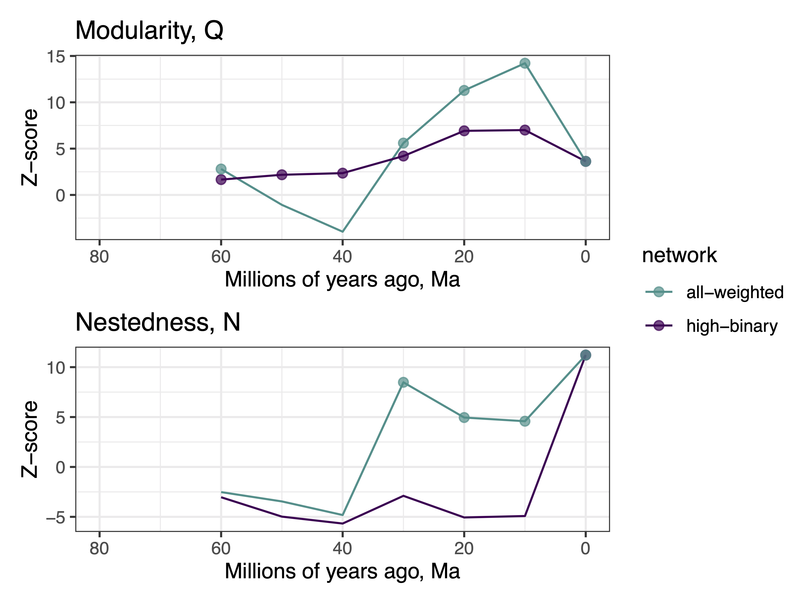
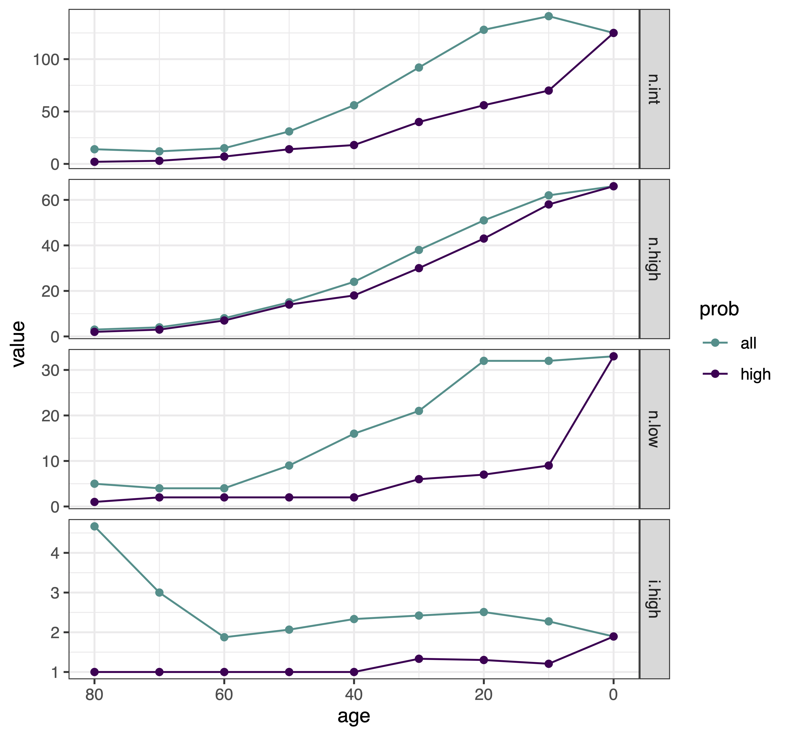

New outline for Pieridae host repertoire ms
================
Mari
03 June, 2020

## Introduction

#### Variability in host use

  - In general, butterflies *(could be more inclusive)* are able use
    more hosts than they actually do - likely don’t express all their
    host use abilities. The fundamental host repertoire (FHR) is wider
    than the realized host repertoire (RHR).

  - Even among the expressed/realized interactions, given that there’s
    usually a `host hierarchy`, we tend to focus on the main hosts.

  - Long tail in `host range distribution`.

  - Method development/availability?

#### Macroevolutionary consequences

  - Growing body of evidence that variability is *necessary(?)* for host
    repertoire evolution and diversification.

  - Among them, using networks (Nat Comms paper) -\> explicit model
    (Syst Biol paper)

#### New ways to account for this variability

  - 3-state model: explicitly models interactions that are not realized
    
      - Discrete interpretation/solution for modeling the
        process/problem
      - **caveat**: doesn’t work well for every data set

  - Use the whole posterior distribution for estimates of ancestral
    interactions with the 2-state model
    
      - “Traditional approach”: HPD (highest posterior density) -
        marginal densities (for each host independently); focus on the
        main host taxon, which is the one that shows clearer signs of
        historical association with the clade.
    
      - Suggested approach: use (almost) all the information from the PD
        (as in tree estimation) - joint probability; interactions with
        lower probability carry information as well; *It has been
        suggested that the FHR is more phylogenetically conserved than
        the RHR* (maybe it will mix up things?)

  - **We will compare the different ways to summarize reconstructions of
    host repertoire evolution**

#### Pieridae

Appropriate group for this comparison since it’s been a classic example
of coevolutionary arms-race with Brassicales host plants. And later,
shown to have network patterns expected by the “diversification by
variability” idea (Braga et al. 2018).

## Results

#### The process

  - Model variants: host tree (time vs. branch length=1)
      - Parameter estimates *(figure 1 - densities)*
      - Main results: bl1; supplementary: time tree
      - *all in 1-Pieridae\_parameters.md*

**Figure 1:**

#### Character history / Ancestral states

  - “Traditional approach”:
      - Highest marginal posterior density (marginal HPD) at internal
        nodes  
      - Marginal probabilities (looks at each host in the repertoire in
        isolation)
      - Modules from extant network, just to facilitate visualization.
      - *Figure 2: For each internal node (ancestral pierid), we are
        confident that this host was used, regardless of the other
        hosts.*

**Figure 2:** 

This way, we ignore most of the posterior distribution. Does it matter?

  - **Networks through time**

Now, we can look at the entire pool of interactions, instead of at one
interaction at a time. The patterns that emerge have information about
the evolutionary process (Braga et al. 2018 Nat Comms). But how to
construct networks from samples of character history?

  - Following “the traditional way”: Make binary (0/1) networks from
    marginal probabilities (each host independently) at each chosen time
    point
      - assumes that an interaction is “true” when mpp \>= 0.9
      - only includes ancestral interactions we are very confident about
      - Easy to calculate modularity and nestedness for 8 ancestral
        networks
      - modules persist over time, since we only recover the stable(?)
        associations

**Figure 3:** Networks and butterfly trees at nine time points during
the diversification of Pieridae. Nodes (butterflies and plants) that are
colored light gray are connected by interactions with marginal posterior
probability lower than 0.9, which are also in light gray. Interactions
with higher probability are in dark gray and connect nodes that are
colored by network modules, which where identified for each network (at
each time point) independently, using only the HPD interactions (p \>=
0.9, dark gray). Modules were named in order of appearance, matching
modules across time points by the nodes that define the module, which
are most often plants.

 *At first I was
considering interpreting these two networks for each time point as being
formed by the realized (colored) and fundamental (light gray) host
repertoires (as we talked about, Niklas and Sören). But that’s an
assumption that was not tested and could take a whole simulation study
just to compare the posteriors from the 3-state and 2-state models (as
Michael pointed out the day after). So, it seems the best option is to
avoid using terms that would make things ambiguous. Most importantly, we
can still talk about variability in host use, but now instead of
focusing on the two “layers” of host repertoire (realized and
fundamental), we focus on extracting information from the whole
posterior distribution for character history.*

It is clear from Fig. 3 that we loose a lot of information (everything
in light gray) by focusing on the high-probability interactions. How can
we get this information?

1)  from joint interaction probabilities, i.e. the probability of the
    entire host repertoire.

<!-- end list -->

  - It is really time-consuming and computationally expensive to
    calculate the posterior probability for entire repertoires.
  - One could build a network for each MCMC sample, calculate its
    properties, and then summarize them in the form of a posterior
    density for nestedness and mudularity. Very expensive though. And
    what about the modules? How to measure the difference between two
    module configurations?

For the module assignment problem, here is one solution:

  - We can calculate how often the interactions on a particular module
    (from the binary HPD network) were sampled during MCMC. Following
    this logic, we can calculate joint-posterior confidence metrics that
    will tell quantify how connected the modules are. This will tackle
    the clear difference in module connectivity between looking at only
    high probability or all interactions.

  - We (Michael, mostly) are working on the code.

For changes in network metrics through time, here is another solution:

2)  Make weighted (or quantitative) networks, where the marginal
    posterior probability is the weight of interaction between a
    butterfly and a host plant.

<!-- end list -->

  - This way we can easily calculate modularity and nestedness, network
    size, host range, and compare them with that of binary HPD networks.
  - Module assignment is a bit tricky because the algorithm has to
    assign every node to one module, even if the node interacts with
    equal weight/strengh to two different modules.

**Figure 4:** Null Hypothesis Testing through time for
nestedness/modularity. Z-score for observed values compared to the
expected if interactions were randomly distributed in the network.
Points show values higher than expected (p \< 0.05). The network at 0,
the present, is binary, that’s why the green line (weighted networks)
stops at 10Ma, but I can add it. Networks at 80 and 70Ma are too small.

**Figure 5:** This is a preliminary figure. I will probably combine
parts of the two figures below, but just so you have an idea of it. For
each weighted and binary network at each time point, I calculated: n.int
= number of interactions, n.high = number of high-trophic level
(butterfly) nodes, n.low = number of low-trophic level (plants) nodes,
i.high = n.int/n.high (mean number of hosts per butterfly).

 

#### Figure list

  - Fig 1. Posterior parameter estimates (possible Supplemental
    Figure??)
  - Fig 2. Ancestral host repertoire estimates w/ modules (nodes)
  - Fig 3. Modules through time (binary HPD networks) **w/
    joint-posterior confidence metrics**
  - Fig 4. Null Hypothesis Testing through time for
    nestedness/modularity
  - Fig 5. Module/Network size through time

Supplementary figures:

  - Marginal posterior probability for every host at nodes for both
    models (time-calibrated and branch-length = 1 host trees)
  - Modules through time (weighted networks)
