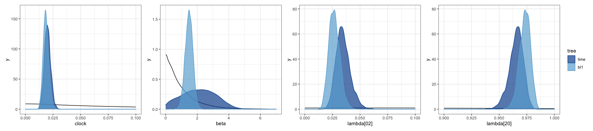
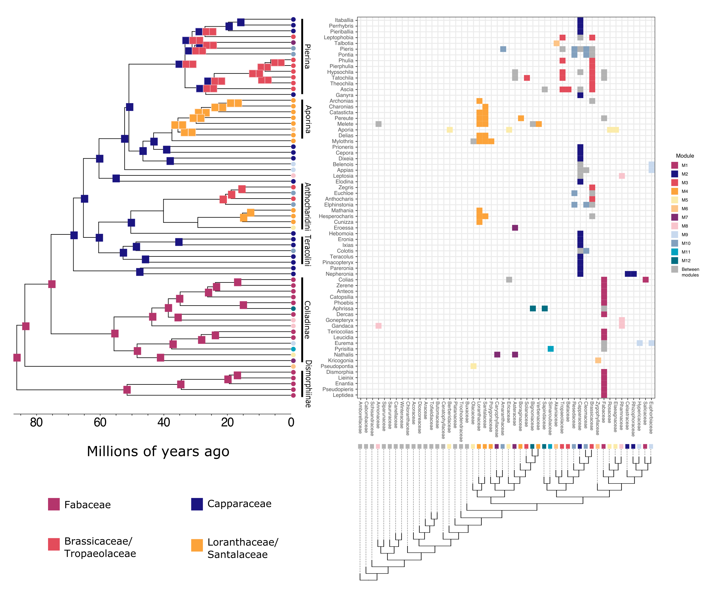

Outline for new introduction
================
Mari
5/13/2020

## Introduction

#### Variability in host use

  - In general, butterflies *(could be more inclusive)* are able use
    more hosts than they actually do - likely don’t express all their
    host use abilities. The fundamental host repertoire (FHR) is wider
    than the realized host repertoire (RHR).

  - Even among the expressed/realized interactions, given that there’s
    usually a `host hierarchy`, we tend to focus on the main hosts.

  - Long tail in `host range distribution`.

  - Method development/availability?

#### Macroevolutionary consequences

  - Growing body of evidence that variability is *necessary(?)* for host
    repertoire evolution and diversification.

  - Among them, using networks (Nat Comms paper) -\> explicit model
    (Syst Biol paper)

#### New ways to account for this variability

  - 3-state model: explicitly models interactions that are not realized
    
      - Discrete interpretation/solution for modeling the
        process/problem
      - **caveat**: doesn’t work well for every data set

  - Use the whole posterior distribution for estimates of ancestral
    interactions
    
      - “Traditional approach”: HPD - marginal densities; focus on the
        main host taxon, which is the one that shows clearer signs of
        historical association with the clade.
    
      - Suggested approach: use (almost) all the information from the PD
        (as in tree estimation) - joint probability; interactions with
        lower probability carry information as well; *It has been
        suggested that the FHR is more phylogenetically conserved than
        the RHR*

  - **We will compare the two ways to summarize reconstructions of host
    repertoire evolution**

#### Pieridae

Appropriate group for this comparison since it’s been a classic example
of coevolutionary arms-race with Brassicales host plants. And later,
shown to have strong similarities with Nymphalidae *(I mean the
conclusions from the Nat Comms paper, maybe not necessary to mention
Nymphalidae)*

## Results

#### The process

  - Model variants: host tree (time vs. branch length=1)
      - Parameter estimates *(figure 1 - densities)*
      - Main results: bl1; supplementary: time tree
      - *all in 1-Pieridae\_parameters.md*

**Figure 1:**

#### Character history / Ancestral states

  - “Traditional approach”:
      - Highest marginal posterior density (marginal HPD) at internal
        nodes  
      - Looks at each host in the repertoire in isolation
      - Modules from extant network, just to facilitate visualization.
      - *Figure 2: For each internal node (ancestral pierid), we are
        confident that this host was used, regardless of the other
        hosts.*

**Figure 2:** 

  - **Enter networks through time**
      - Now, we can look at the entire pool of interactions, instead of
        at one interaction at a time. The patterns that emerge have
        information about the evolutionary process (Braga et al. 2018
        Nat Comms). But how to construct networks from samples of
        character history?
          - from marginal probabilities (each host independently)
          - from joint probabilities (entire host repertoire)

**Figure 3:** 

  - Suggested approach:
      - Treat posterior probabilities as a measure of strength of
        interaction *(in coevolutionary terms / strength of historical
        interaction / …)*
      - Look at the repertoire as a whole (joint probability). Too many
        unique repertoires, hard to summarize. Thus, use networks to
        find interaction patterns.

#### Figure list

  - Fig 1. Posterior parameter estimates (possible Supplemental
    Figure??)
  - Fig 2. Ancestral host repertoire estimates w/ modules (nodes)
  - Fig 3. Modules through time **w/ joint-posterior confidence
    metrics**
  - Fig 4. Null Hypothesis Testing through time for
    nestedness/modularity
  - Fig 5. Module/Network size through time
