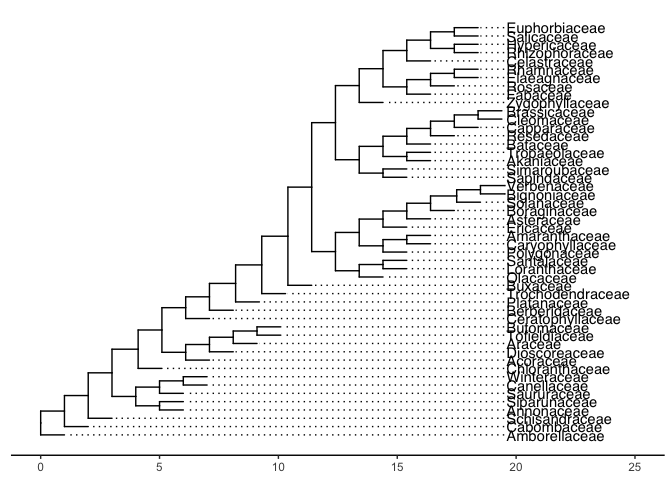

Pieridae host repertoire
================
Mariana Braga
4/22/2020

Script for empirical study performed in Braga et al. 2020 Evolution of
butterfly-plant networks revealed by Bayesian inference of host
repertoire

``` r
library(ape)
library(phytools) # needed?
```

    ## Loading required package: maps

``` r
library(dispRity)
```

    ## Registered S3 method overwritten by 'geiger':
    ##   method            from
    ##   unique.multiPhylo ape

    ##        --- dispRity package ---
    ## This is the CRAN release version (1.3.5) of the package.
    ## For more functionalities, news, vignettes and releases,
    ## visit https://github.com/TGuillerme/dispRity

``` r
library(ggtree)
```

    ## Registered S3 method overwritten by 'treeio':
    ##   method     from
    ##   root.phylo ape

    ## ggtree v2.0.1  For help: https://yulab-smu.github.io/treedata-book/
    ## 
    ## If you use ggtree in published research, please cite the most appropriate paper(s):
    ## 
    ## - Guangchuang Yu, Tommy Tsan-Yuk Lam, Huachen Zhu, Yi Guan. Two methods for mapping and visualizing associated data on phylogeny using ggtree. Molecular Biology and Evolution 2018, 35(12):3041-3043. doi: 10.1093/molbev/msy194
    ## - Guangchuang Yu, David Smith, Huachen Zhu, Yi Guan, Tommy Tsan-Yuk Lam. ggtree: an R package for visualization and annotation of phylogenetic trees with their covariates and other associated data. Methods in Ecology and Evolution 2017, 8(1):28-36, doi:10.1111/2041-210X.12628

    ## 
    ## Attaching package: 'ggtree'

    ## The following object is masked from 'package:ape':
    ## 
    ##     rotate

``` r
library(picante)
```

    ## Loading required package: vegan

    ## Loading required package: permute

    ## Loading required package: lattice

    ## This is vegan 2.5-6

    ## Loading required package: nlme

    ## 
    ## Attaching package: 'nlme'

    ## The following object is masked from 'package:ggtree':
    ## 
    ##     collapse

``` r
library(tidyverse)
```

    ## ── Attaching packages ─────────────────────────────────────────────────────────────────────────────────── tidyverse 1.3.0 ──

    ## ✓ ggplot2 3.3.0     ✓ purrr   0.3.3
    ## ✓ tibble  2.1.3     ✓ dplyr   0.8.4
    ## ✓ tidyr   1.0.2     ✓ stringr 1.4.0
    ## ✓ readr   1.3.1     ✓ forcats 0.5.0

    ## ── Conflicts ────────────────────────────────────────────────────────────────────────────────────── tidyverse_conflicts() ──
    ## x dplyr::collapse() masks nlme::collapse(), ggtree::collapse()
    ## x tidyr::expand()   masks ggtree::expand()
    ## x dplyr::filter()   masks stats::filter()
    ## x dplyr::lag()      masks stats::lag()
    ## x purrr::map()      masks maps::map()

``` r
library(patchwork)
library(wesanderson)

library(MCMCpack)
```

    ## Loading required package: coda

    ## Loading required package: MASS

    ## 
    ## Attaching package: 'MASS'

    ## The following object is masked from 'package:patchwork':
    ## 
    ##     area

    ## The following object is masked from 'package:dplyr':
    ## 
    ##     select

    ## ##
    ## ## Markov Chain Monte Carlo Package (MCMCpack)

    ## ## Copyright (C) 2003-2020 Andrew D. Martin, Kevin M. Quinn, and Jong Hee Park

    ## ##
    ## ## Support provided by the U.S. National Science Foundation

    ## ## (Grants SES-0350646 and SES-0350613)
    ## ##

    ## 
    ## Attaching package: 'MCMCpack'

    ## The following object is masked from 'package:vegan':
    ## 
    ##     procrustes

``` r
library(coda)
library(kdensity)
#library(phylotate) # needed?
#library(data.table) # needed in script sourced

library(bipartite)
```

    ## Loading required package: sna

    ## Loading required package: statnet.common

    ## 
    ## Attaching package: 'statnet.common'

    ## The following object is masked from 'package:base':
    ## 
    ##     order

    ## Loading required package: network

    ## network: Classes for Relational Data
    ## Version 1.16.0 created on 2019-11-30.
    ## copyright (c) 2005, Carter T. Butts, University of California-Irvine
    ##                     Mark S. Handcock, University of California -- Los Angeles
    ##                     David R. Hunter, Penn State University
    ##                     Martina Morris, University of Washington
    ##                     Skye Bender-deMoll, University of Washington
    ##  For citation information, type citation("network").
    ##  Type help("network-package") to get started.

    ## sna: Tools for Social Network Analysis
    ## Version 2.5 created on 2019-12-09.
    ## copyright (c) 2005, Carter T. Butts, University of California-Irvine
    ##  For citation information, type citation("sna").
    ##  Type help(package="sna") to get started.

    ## 
    ## Attaching package: 'sna'

    ## The following object is masked from 'package:nlme':
    ## 
    ##     gapply

    ## The following object is masked from 'package:ape':
    ## 
    ##     consensus

    ##  This is bipartite 2.14.
    ##  For latest changes see versionlog in ?"bipartite-package". For citation see: citation("bipartite").
    ##  Have a nice time plotting and analysing two-mode networks.

    ## 
    ## Attaching package: 'bipartite'

    ## The following object is masked from 'package:vegan':
    ## 
    ##     nullmodel

``` r
library(ggraph)
library(tidygraph)
```

    ## 
    ## Attaching package: 'tidygraph'

    ## The following object is masked from 'package:MASS':
    ## 
    ##     select

    ## The following object is masked from 'package:stats':
    ## 
    ##     filter

``` r
library(igraph)
```

    ## 
    ## Attaching package: 'igraph'

    ## The following object is masked from 'package:tidygraph':
    ## 
    ##     groups

    ## The following object is masked from 'package:bipartite':
    ## 
    ##     strength

    ## The following objects are masked from 'package:sna':
    ## 
    ##     betweenness, bonpow, closeness, components, degree, dyad.census,
    ##     evcent, hierarchy, is.connected, neighborhood, triad.census

    ## The following objects are masked from 'package:network':
    ## 
    ##     %c%, %s%, add.edges, add.vertices, delete.edges, delete.vertices,
    ##     get.edge.attribute, get.edges, get.vertex.attribute, is.bipartite,
    ##     is.directed, list.edge.attributes, list.vertex.attributes,
    ##     set.edge.attribute, set.vertex.attribute

    ## The following objects are masked from 'package:dplyr':
    ## 
    ##     as_data_frame, groups, union

    ## The following objects are masked from 'package:purrr':
    ## 
    ##     compose, simplify

    ## The following object is masked from 'package:tidyr':
    ## 
    ##     crossing

    ## The following object is masked from 'package:tibble':
    ## 
    ##     as_data_frame

    ## The following object is masked from 'package:vegan':
    ## 
    ##     diversity

    ## The following object is masked from 'package:permute':
    ## 
    ##     permute

    ## The following object is masked from 'package:dispRity':
    ## 
    ##     radius

    ## The following objects are masked from 'package:ape':
    ## 
    ##     edges, mst, ring

    ## The following objects are masked from 'package:stats':
    ## 
    ##     decompose, spectrum

    ## The following object is masked from 'package:base':
    ## 
    ##     union

``` r
#library(ndtv)        # needed?
#library(intergraph)  # needed?


#### INPUT DATA ####

# _Read trees ----
path_data <- "./data/"
tree <- read.tree(paste0(path_data,"bphy_pie_ladder.phy"))
host_tree <- read.tree(paste0(path_data,"angio_pie_50tips_ladder.phy"))

## for figure 2
host_tree_bl1 <- read.tree(paste0(path_data,"angio_pie_50tips_bl1.phy"))

ggtree(host_tree_bl1) + 
  theme_tree2() + 
  geom_tiplab(align=TRUE, linesize=.5) + 
  xlim(0, 25)
```

<!-- -->
